---
tags:
    - Moduł 1
    - date-a-scientist
    - biblioteka
    - anaconda
    - UnicodeEncodeError
    - FileNotFoundError
    - ModuleNotFoundError
    - NameError
---
# **Biblioteka `date-a-scientist` - instalacja i problemy**

`date-a-scientist` to narzędzie, które pozwala zadawać pytania dotyczące danych w formacie Pandas DataFrame bezpośrednio w Jupyter Notebooku, wykorzystując do tego język naturalny. Dzięki niemu możesz analizować i przetwarzać dane w sposób bardziej intuicyjny, formułując zapytania w prostym, zrozumiałym dla Ciebie języku, zamiast pisać skomplikowany kod.

## **Jak zainstalować bibliotekę `date-a-scientist`?**

- Dodaj nową komórkę w jupyter notebook
- wklej i uruchom poniższy kod

```python
!pip install -U date-a-scientist
```

## **Widzę błąd `ERROR: Could not find a version that satisfies the requirement`**

Sprawdź czy nie masz literówki w nazwie pakietu. Może być tak, że nazwa pakietu jest niepoprawna.

* Poprawna nazwa pakietu to `date-a-scientist` (z myślnikiem, a nie podkreślnikiem).
* Częstym błędem jest wpisywanie `data` zamiast `date`.

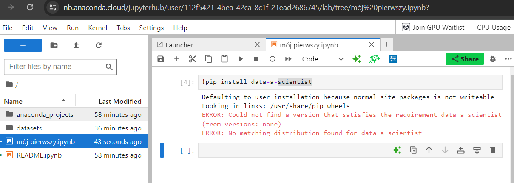

## **Po instalacji pakietu `date-a-scientist` z Anaconda Cloud nie mogę go zaimportować albo notebook go nie widzi**

Jeśli wszystko wydaje się być w porządku, lecz pojawiają się poniższe błędy:

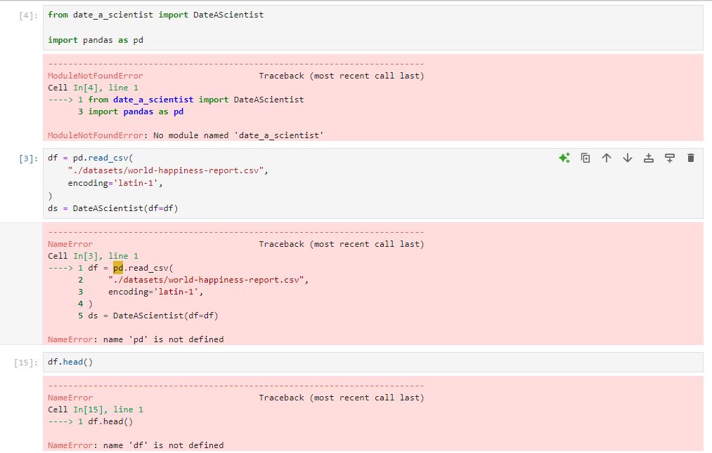

Spróbuj zrestartować kernel i uruchomić ponownie wszystkie komórki w notebooku Jupyter. Aby to zrobić, kliknij przycisk oznaczony na poniższym obrazku (`Restart the kernel and run all cells`).

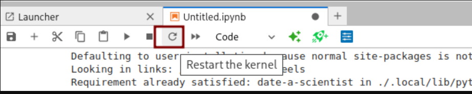

Znajdziesz go w górnej części interfejsu, obok przycisków nawigacyjnych. Po kliknięciu tego przycisku kernel zostanie zrestartowany, a wszystkie komórki w notebooku zostaną uruchomione ponownie.

## **Widzę błąd `UnicodeEncodeError` jak wpisuję polskie znaki w date-a-scientist**

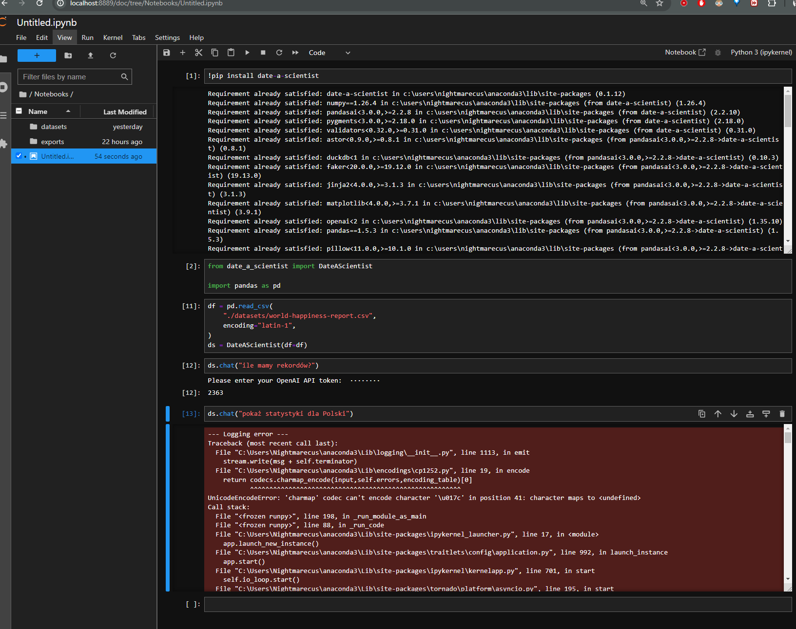

Żeby zaadresować ten problem wykonaj następujące kroki (na Windowsie):

1. Otwórz **Panel sterowania**.
1. Przejdź do **System i zabezpieczenia > System > Zaawansowane ustawienia systemu**.
1. Kliknij przycisk **Zmienne środowiskowe**.
1. W sekcji **Zmienne systemowe** kliknij **Nowa**.
1. Dodaj zmienną:
    * Nazwa zmiennej: `PYTHONIOENCODING`
    * Wartość zmiennej: `utf-8`
1. Dodaj kolejną zmienną:
    * Nazwa zmiennej: `PYTHONUTF8`
    * Wartość zmiennej: `1`
1. Zatwierdź zmiany, klikając **OK**.

I wówczas zamknij Jupyter Lab i otwórz ponownie

## **Nie mogę zainstalować pakietu `date-a-scientist`. Widzę ogromny komunikat o błędzie**

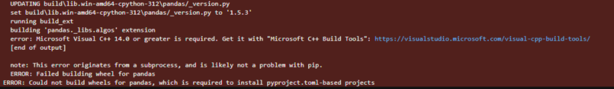

Jeśli widzisz błąd, w pierwszej kolejności sprawdzaj jego początek i koniec. Tam najczęściej jest najwięcej informacji. W tym przypadku zerknij na koniec komunikatu i zwróć uwagę czy zawiera informację o braku `Microsoft Visual C++`. Np w komunikacie: `error: Microsoft Visual C++ 14.0 is required. Get it with "Microsoft Visual C++ Build Tools": https://visualstudio.microsoft.com/visual-cpp-build-tools/` Jeśli tak, to należy zainstalować `Microsoft Visual C++ Build Tools` z linku podanego w komunikacie. Ważne jest, aby podczas instalacji zaznaczyć opcję `Programowanie aplikacji klasycznych w C++`.

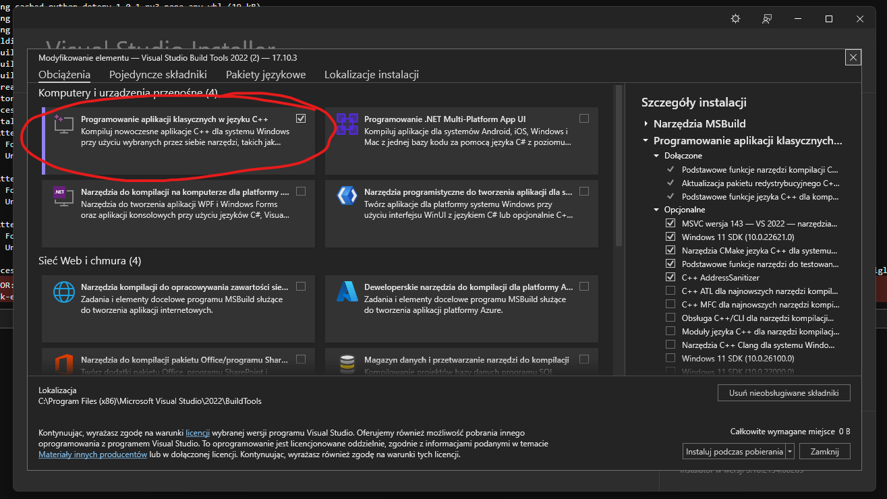

## **W trakcie instalacji pakietu `date-a-scientist` pojawiają się różne kolorowe komunikaty o ostrzeżeniach i błędach**

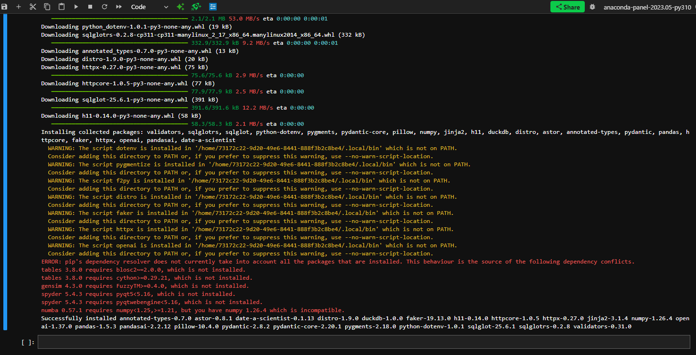

Jeśli zobaczysz całą serię ostrzeżeń i błędów podczas instalacji, nie musisz się martwić, o ile na końcu pojawi się komunikat o pomyślnym zainstalowaniu biblioteki. Dla pewności możesz ponownie uruchomić komórkę z instalacją – to powinno usunąć wszelkie ostrzeżenia.

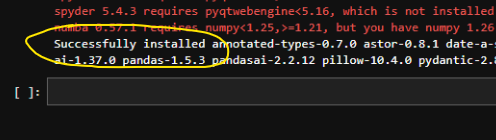

Zaznaczony fragment świadczy o prawidłowym zainstalowaniu biblioteki.

## **Widzę błąd `FileNotFoundError` podczas pracy z `date-a-scientist`**

Jeżeli widzisz błąd jak na obrazku poniżej:

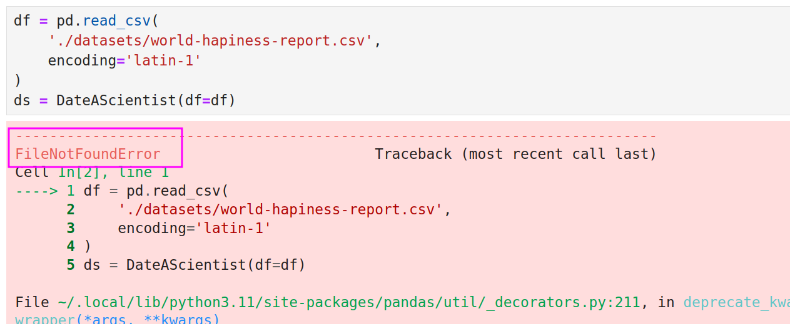

Zwróć uwagę na początek komunikatu o błędzie .
Jeśli jest tam informacja o braku pliku (np. `FileNotFoundError` jak na obrazku) to najprawdopodobniej masz błąd w ścieżce lub plik nie został pobrany we wskazane miejsce.

* **Sprawdź czy ścieżki są poprawne** np. czy nie ma błędów w nazwach folderów - dużych liter, spacji itp. - domyślnie w kursie używamy folderu *datasets*
* **Sprawdź czy plik istnieje we wskazanej lokalizacji** np. czy nie został usunięty, czy nie zmieniła się jego nazwa - często przy ponownym pobraniu plików z kursu zmieniają się ich nazwy na **nazwa_pliku(1).csv** itp.
* **Sprawdź czy plik nie jest uszkodzony** - jeśli plik został pobrany niekompletnie, to może być uszkodzony i nie da się go otworzyć
* **Sprawdź czy plik ma odpowiednie rozszerzenie** - plik CSV powinien mieć rozszerzenie `.csv`, plik Excel `.xlsx`, notebook `.ipynb`, a plik python `.py`

Pliki z danymi znajdziesz w sekcji `Pliki do pobrania` pod filmami na platformie kursu.

## **Widzę błąd `ModuleNotFoundError: No module named 'pkg_resources'` podczas instalacji pakietu `date-a-scientist`**

Przyczyną błędu jest niezgodność pakietu `date-a-scientist` (a dokładniej jego zależności np. `pandas`) z wersją Pythona 3.12.

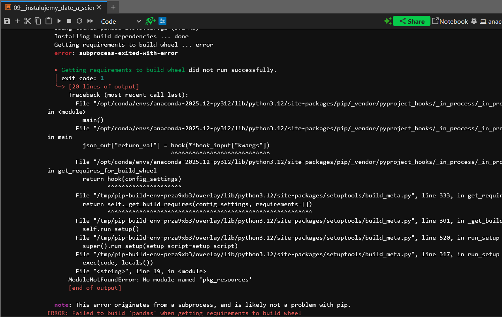

Rozwiązaniem jest utworzenie **nowego środowiska z Pythonem 3.11** i ustawienie go jako runtime dla notebooka. Obecnie w oknie wyboru kernela (przy opcji „Assign a Runtime”) dostępne są wyłącznie opcje z Pythonem 3.12:

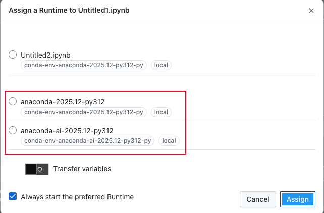

Poniżej znajdziesz instrukcję, jak dodać środowisko z Pythonem 3.11 i wyświetlić je na liście dostępnych runtime'ów.

### **Krok 1: Otwarcie terminala w Anaconda Cloud**

Otwórz menu **File** i wybierz **New Launcher**. Na stronie launcher'a znajdź sekcję **Other** i kliknij ikonę **Terminal**:

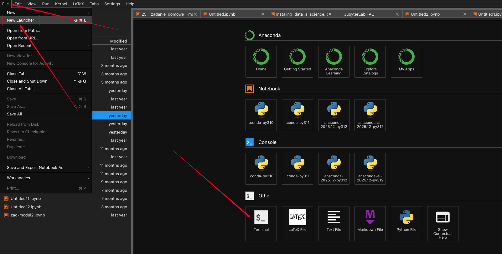

### **Krok 2: Utworzenie środowiska z Pythonem 3.11**

1. W terminalu wpisz poniższą komendę i zatwierdź ją klawiszem Enter:
```bash
conda create -n py311 python=3.11 ipykernel
```
Parametr `ipykernel` jest niezbędny – dzięki niemu nowe środowisko pojawi się jako opcja runtime w JupyterLab.
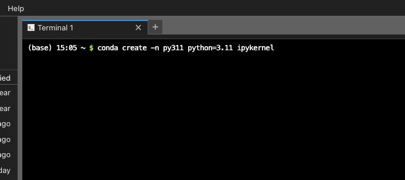


1. Podczas tworzenia środowiska może pojawić się pytanie o potwierdzenie instalacji niektórych pakietów. Wpisz `y` i naciśnij Enter:
   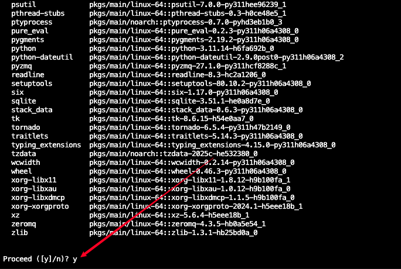

1. Po zakończeniu działania komendy zobaczysz komunikat o pomyślnym utworzeniu środowiska (u Ciebie może być delikatnie inny):
   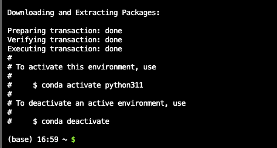

!!!warning "Uwaga"
    Proces tworzenia środowiska może trwać kilka minut. W tym czasie nie klikaj nic w interfejsie ani nie zamykaj terminala.

### **Krok 3: Weryfikacja nowego runtime'u**

Po zakończeniu działania komendy:

1. **Odśwież stronę** w przeglądarce (np. klawiszem F5 lub Ctrl+R / Cmd+R).
1. Otwórz ponownie **New Launcher** (menu **File → New Launcher**).
1. W sekcjach **Notebook** i **Console** powinna pojawić się opcja `.conda-py311` – nowy runtime z Pythonem 3.11.
   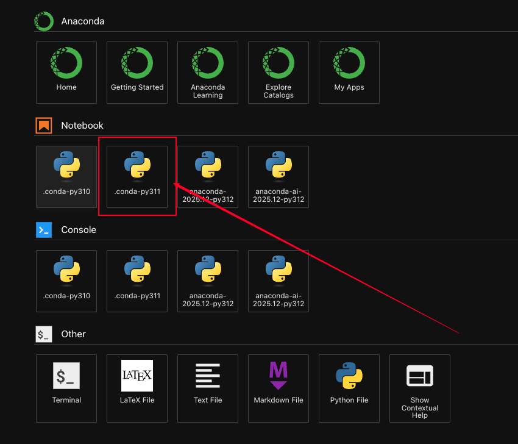

!!! warning "Uwaga"
    Czasem nowy runtime pojawia się dopiero po ok. 10 minutach. Jeśli nie widzisz opcji `.conda-py311` od razu po odświeżeniu, poczekaj chwilę i odśwież stronę ponownie.

### **Krok 4: Zmiana kernela**

1. Gdy runtime `.conda-py311` będzie widoczny, otwórz notebook i kliknij w tym miejscu (na górze po prawej stronie okna notebooka), aby zmienić kernel:
   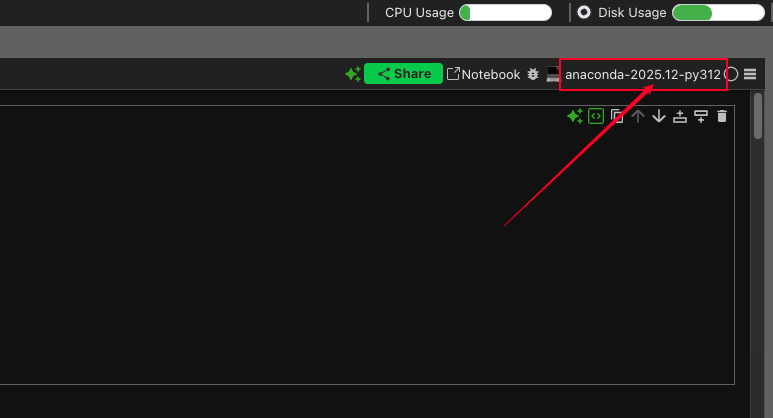

1. W oknie przypisywania runtime'u wybierz nowo utworzone środowisko `.conda-py311`:
   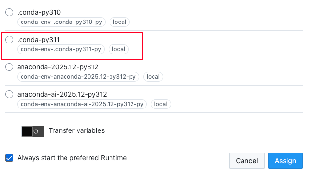

### **Krok 5: Instalacja pakietu `date-a-scientist` oraz `PyYAML`**


1. Wykonaj instalację pakietu `date-a-scientist` w tym środowisku.
   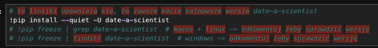

1. Kolejnym krokiem jest instalacja pakietu `PyYAML`, ponieważ jest to zależność pakietu `date-a-scientist` potrzebna do poprawnego działania. Aby to zrobić w kolejnej komórce notebooka wpisz i uruchom:

    ```bash
    !pip install PyYAML
    ```
    Po zakończeniu instalacji zobaczysz komunikat o pomyślnym zainstalowaniu pakietu `PyYAML`:
   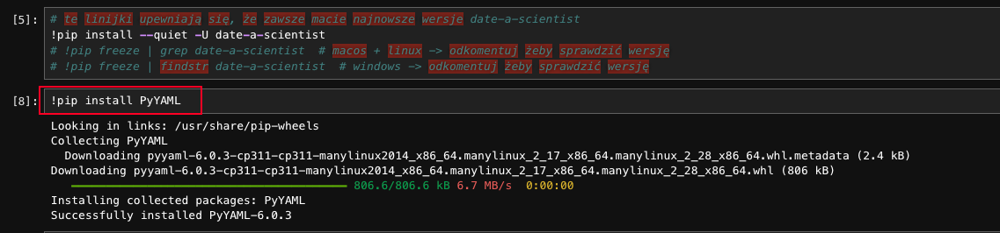

1. Uruchom kolejne komórki w notebooku, aby sprawdzić czy pakiet `date-a-scientist` został poprawnie zainstalowany.
