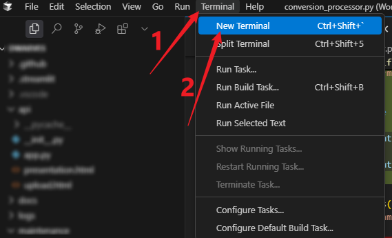
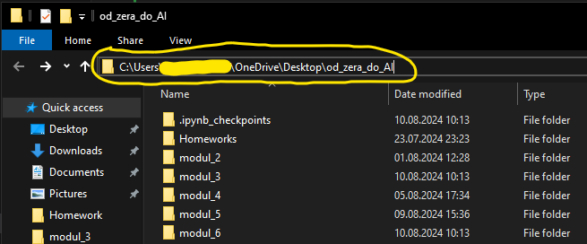
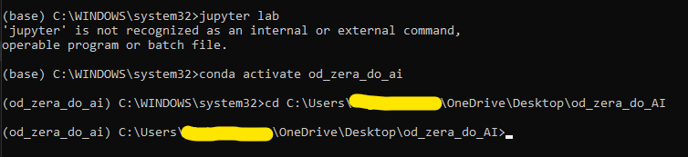

---
tags:
  - Moduł 3
  - conda
  - anaconda prompt
  - jupyter lab
  - notebook
  - kernel
  - plot error
---

# **Conda - instalacja, konfiguracja i błędy**

**Conda** to narzędzie do zarządzania środowiskami w Pythonie. Dzięki niemu możemy łatwo instalować i zarządzać pakietami w Pythonie.

## **Jak zainstalować conda**

- [Instrukcja instalacji conda pod Macos](assets/conda__installation_for_macos.pdf)
- [Instrukcja instalacji conda pod Windows](assets/conda__installation_for_windows.pdf)
- [Instrukcja instalacji conda pod Ubuntu](assets/conda__installation_for_ubuntu.pdf)

## **Jak skonfigurować conda**

- [Instrukcja konfiguracji conda](assets/conda__configuration.pdf)

### **Jak ułatwić sobie pracę z Anaconda Prompt na Windows**

<div class="video-wrapper">
    <iframe width="1280" height="720" src="https://www.youtube.com/embed/Y_iqaAqZNkI?si=ZrlXfxIDaxktL85-" title="YouTube video player" frameborder="0" allow="accelerometer; autoplay; clipboard-write; encrypted-media; gyroscope; picture-in-picture; web-share" referrerpolicy="strict-origin-when-cross-origin" allowfullscreen></iframe>
</div>

## **Jak ustawić środowisko conda do pracy z Visual Studio Code i PowerShell**

Podczas pierwszej próby uruchomienia środowiska wirtualnego conda w terminalu VS Code może wystąpić następujący problem.

```
The term 'conda' is not recognized as the name of a cmdlet, function, script file, or operable program.
```


**Poniżej znajduje się film instruujący jak skonfigurować środowisko conda do pracy z Visual Studio Code i PowerShell.**

W filmie zaprezentuję kilka komend. Umieszczam je pod filmem, żebyście mogli je łatwo skopiować i wkleić.


### **Film instruktażowy**

**Tak jak wspominam w filmie, pamiętajcie o ponownym uruchomieniu komputera, po ustawieniu zmiennych środowiskowych.**

<div class="video-wrapper">
    <iframe width="1280" height="720" src="https://www.youtube.com/embed/fJwRbh-CTzw?si=Avwud5JEBSWy326T" title="YouTube video player" frameborder="0" allow="accelerometer; autoplay; clipboard-write; encrypted-media; gyroscope; picture-in-picture; web-share" referrerpolicy="strict-origin-when-cross-origin" allowfullscreen></iframe>
</div>

### **Komendy do skopiowania i wklejenia**

**Inicjalizacja condy w powershell**

```bash
conda init powershell
```

**Ustawienie uprawnień do uruchamiania skryptów dla PowerShell**

```powershell
Set-ExecutionPolicy RemoteSigned -Scope CurrentUser
```

**Spradzenie wersji conda**

```bash
conda --version
```

**Aktywacja środowiska wirtualnego conda**

```bash
conda activate nazwa_środowiska
```

**Utworzenie nowego środowiska wirtualnego conda**

```bash
conda create -n nazwa_środowiska python=3.11
```

**Deaktywacja środowiska wirtualnego conda**

```bash
conda deactivate
```

**Kod testowej aplikacji w streamlit, do zapisania w pliku `app.py`**

```python
import streamlit as st

st.write("Hello World")
```

**Uruchomienie aplikacji w streamlit**

```bash
streamlit run app.py
```

### **Zainstalowałem i skonfigurowałem condę, jednak folder `modul_3` jest pusty**


Na początku folder `modul_3` jest pusty, ale z każdą kolejną lekcją stopniowo go zapełnisz. Pod filmami znajdziesz pliki do pobrania (zazwyczaj będą to notebooki), które będziesz musiał dodać do folderu `modul_3`.


Po pobraniu plików, przenieś je do folderu `modul_3`.
Docelowo na końcu modułu Twój folder będzie wyglądał tak:


## **Błędy w Conda - Przyczyny i rozwiązania**

'conda' to wszechstronne narzędzie do zarządzania środowiskami Python. Umożliwia ono łatwe instalowanie i zarządzanie pakietami, co znacząco ułatwia pracę z Pythonem. Niemniej jednak, podczas korzystania z conda można napotkać różne błędy. W tej sekcji znajdziesz przegląd najczęstszych problemów, ich możliwe przyczyny oraz sprawdzone sposoby na ich rozwiązanie.

### **Widzę błąd: `Value type <class 'str'> must match with type plot`**

Niektóre polecenia w Condzie działają poprawnie, ale gdy próbuję narysować wykres, pojawia się następujący błąd:


1. Sprawdź nazwę folderu, w którym znajduje się używany notebook.

    - Domyślnie w kursie jest on zapisany pod nazwą modul\_\*, gdzie gwiazdka oznacza numer modułu.
    - Upewnij się, że nazwa Twojego folderu nie zawiera spacji (zamiast spacji warto użyć podkreślnika)

    

1. Zrestartuj kernel i uruchom ponownie wszystkie komórki, zaczynając od pierwszej.

    

Dla zainteresowanych: przyczyną występowania błędu jest walidacja w bibliotece [pandasai](https://github.com/Sinaptik-AI/pandas-ai/blob/e011e8ffdc8a2cd88db07c4440f331540a175648/pandasai/helpers/output_validator.py#L99).

### **Błąd `conda is not recognized` w terminalu VS Code**

Problem występuje podczas próby aktywacji środowiska wirtualnego conda w terminalu VS Code. System wyświetla komunikat:

```
The term 'conda' is not recognized as the name of a cmdlet, function, script file, or operable program.
```


**Przyczyna:**
Terminal VS Code nie ma skonfigurowanego dostępu do poleceń conda, ponieważ PowerShell nie został zainicjalizowany z Anacondą.

**Rozwiązanie:**

**Metoda 1 - Restart terminala:**

1. Zamknij terminal w VS Code (kliknij ikonę kosza).
   
2. Otwórz nowy terminal i poczekaj kilka sekund na pełne wczytanie.
   
3. Spróbuj ponownie aktywować środowisko.

**Metoda 2 - Inicjalizacja conda (jeśli metoda 1 nie pomogła):**

1. Zamknij VS Code.
1. Otwórz **Windows PowerShell** jako administrator:

    - Kliknij prawym przyciskiem myszy na ikonę **Windows PowerShell**
    - Wybierz opcję **"Uruchom jako administrator"** (lub **"Run as administrator"** w zależności od języka systemowego)

    

1. Sprawdź aktualne ustawienia ExecutionPolicy (uprawnienia do uruchamiania skryptów):
    ```powershell
    Get-ExecutionPolicy
    ```
1. Jeśli wynik to `Restricted` lub `Undefined`, zmień na `RemoteSigned`:
    ```powershell
    Set-ExecutionPolicy RemoteSigned -Scope CurrentUser
    ```
1. Potwierdź zmianę wpisując `Y` i naciśnij Enter.
1. Sprawdź czy ustawienia zostały zmienione (powinny być `RemoteSigned`):
    ```powershell
    Get-ExecutionPolicy
    ```
1. Otwórz **Anaconda Prompt** (również jako administrator).
1. Wykonaj inicjalizację PowerShell:
    ```bash
    conda init powershell
    ```
1. Otwórz ponownie VS Code i użyj nowego terminala (kliknij ikonę kosza i otwórz nowy terminal - sposób opisany w **Metoda 1 - Restart terminala**).

    > **⚠️ UWAGA:** Odczekaj około 30 sekund na pełne wczytanie terminala i wszystkich procesów.

1. Sprawdź czy conda działa poprawnie:
    ```bash
    conda --version
    ```
1. Jeśli wszystko działa poprawnie (powinna się pojawić wersja conda), aktywuj swoje środowisko wirtualne:
    ```bash
    conda activate nazwa_środowiska
    ```

## **Problemy z jupyter lab / notebooki**

**Jupyter lab** to interaktywne środowisko do pracy z notatnikami jupyter. Pozwala na pracę z wieloma notatnikami jednocześnie, a także na przeglądanie plików, terminal, konsolę pythona i wiele innych.

### **Jupyter startuje, ale nie działa. Widzę okno przeglądarki, ale Jupyter się nie odpala**

Może oznaczać, że masz zablokowane wyskakujące okna w przeglądarce. Spróbuj uruchomić Jupyter Notebook bezpośrednio z uprawnieniami administratora. Następnie pojawi się konsola, w której będzie widać logi Jupyter Notebooka, które zawierają link do notebooka. Skopiuj ten link i wklej go do przeglądarki. Link powinien wyglądać mniej więcej tak:

`http://localhost:8888/tree?token=f7e5908823221f7bc83e0382337300e6bbe552e2013cc27f`

Twój token będzie inny!


### **Kiedy uruchamiam _jupyter lab_ przez terminal pojawia się nietypowy błąd**


Jeśli podczas uruchamiania _jupyter lab_ w konsoli pojawia się taki błąd, oznacza to, że nie aktywowałeś swojego środowiska Conda. Aby to zrobić:

1. Najpierw aktywuj swoje środowisko, wpisując `conda activate od_zera_do_ai` (domyślnie według kursu). Zauważysz wtedy, że środowisko zostało zmienione z domyślnego 'base' na Twoje własne.

    

1. Następnie przejdź do folderu z Twoimi notebookami (domyślnie w kursie jest to folder na pulpicie o nazwie _od_zera_do_ai_) i skopiuj jego ścieżkę.

    

1. Przejdź do tego folderu w konsoli, używając komendy `cd` i wklejając jego ścieżkę

    

1. Na koniec uruchom `jupyter lab`

    

## **Jak stworzyć nowe środowisko Conda z pliku `environment.yml`**

Poniższa instrukcja pokazuje, jak utworzyć gotowe środowisko na podstawie przygotowanego pliku `environment.yml`. To najprostszy sposób, aby wszyscy mieli identyczną konfigurację pakietów.

### **1) Pobierz plik `environment.yml`**

- **Pobierz plik:** <a href="../assets/environment.yml" download>environment.yml</a>
- Zapisz plik w wybranym folderze (np. `Pulpit/od_zera_do_ai`).

### **2) Otwórz terminal Anaconda Prompt**

### **3) Przejdź do folderu z plikiem**

Uruchom w terminalu Anaconda Prompt następującą komendę:

dla Windows:

```bash
cd C:\Users\TwojeImie\Desktop\od_zera_do_ai
```

dla macOS/Linux:

```bash
cd ~/Desktop/od_zera_do_ai
```

!!! warning "Uwaga"
    Tutaj wstaw **swoją** ścieżkę do folderu!

!!! tip "Szybciej z uzupełnianiem ścieżki"
    Zamiast ręcznie wpisywać ścieżkę do folderu, po wpisaniu `cd` i spacji możesz po prostu przeciągnąć folder `od_zera_do_ai` do terminala — ścieżka zostanie wtedy automatycznie uzupełniona.

Upewnij się, że w tym folderze (w tym projekcie `od_zera_do_ai`) znajduje się pobrany wcześniej plik `environment.yml`.

### **4) Utwórz środowisko na podstawie pliku**

Wybierz odpowiednią komendę:

- domyślnie zostanie użyta nazwa środowiska wskazana w pliku (`od_zera_do_ai_v2`):

```bash
conda env create -f environment.yml
```

- jeśli chcesz wymusić własną nazwę środowiska:

```bash
conda env create -f environment.yml -n moja_nazwa_srodowiska
```

Podczas instalacji Conda może poprosić o potwierdzenie – wpisz `y` i naciśnij Enter.

!!! warning "Uwaga"
    Cały proces może zająć nawet około 10 minut. Zależy to od szybkości internetu i mocy komputera. Zatem nie zamykaj terminala ani nie zamykaj środowiska przed jego zakończeniem.

### **5) Aktywuj środowisko**

Po pomyślnym zakończeniu instalacji, aktywuj środowisko:

```bash
conda activate od_zera_do_ai_v2
```

Jeśli użyłeś własnej nazwy, aktywuj odpowiednio: `conda activate moja_nazwa_srodowiska`.

### **6) Szybka weryfikacja**

```bash
conda list
python --version
jupyter lab --version
```

Jeżeli widzisz listę pakietów i wersje poleceń się wyświetlają – środowisko działa.

### **7) Jak zaktualizować istniejące środowisko z nowego pliku?**

Gdy plik `environment.yml` zostanie zaktualizowany (np. dojdą pakiety), zaktualizuj swoje środowisko:

```bash
conda env update -f environment.yml --prune
```

Flaga `--prune` usuwa pakiety, które nie występują już w pliku.

### **8) Najczęstsze problemy i rozwiązania**

- **`conda is not recognized`**: zainicjalizuj Condę w PowerShell albo użyj Anaconda Prompt (patrz sekcja wyżej o konfiguracji Condy).
- **`SpecNotFound: environment.yml`**: upewnij się, że jesteś w katalogu z plikiem (`dir` na Windows lub `ls` na macOS/Linux).
- **Środowisko już istnieje**: użyj aktualizacji (`conda env update -f environment.yml --prune`) albo usuń stare środowisko i utwórz ponownie:
  ```bash
  conda env remove -n od_zera_do_ai_v2
  conda env create -f environment.yml
  ```