# **Visual Studio Code - instalacja i konfiguracja**

**Visual Studio Code** to darmowe narzędzie do edycji kodu tzw. **IDE (Integrated Development Environment)**, które jest dostępne na Windows, Mac i Linux. W tym dokumencie dowiesz się jak zainstalować Visual Studio Code, jak korzystać z niego oraz jak zainstalować pluginy. 

## **Jak zainstalować Visual Studio Code?**

* Uruchum link: [https://code.visualstudio.com/download](https://code.visualstudio.com/download)
* wybierz Windows jeśli masz Windowsa, Mac jeśli masz Maca, Linux jeśli masz Linuksa
* po kliknięciu rozpocznie się pobieranie instalatora
* uruchom instalator
* postępuj zgodnie z instrukcjami na ekranie
* pamiętaj, aby utworzyć skrót na pulpicie

## **Jak zapisywać zmiany w pliku?**

Aby zapisać zmiany w pliku w Visual Studio Code:

* w górnym pasku menu kliknij `Plik` > `Zapisz`

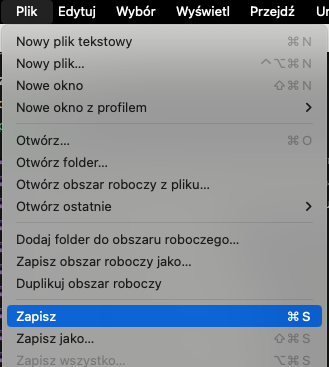

* lub wciśnij `ctrl + s` (jednocześnie kliknij `ctrl` i `s`) w Windows
* lub `cmd + s` w Macos (jednocześnie kliknij `cmd` i `s`)

## **Jak chować Eksplorator plików i folderów?**

Eksplorator plików i folderów to lewa kolumna w Visual Studio Code, w której możemy przeglądać pliki i foldery w naszym projekcie.

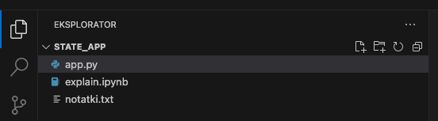

Aby schować Eksplorator plików i folderów w Visual Studio Code:

* kliknij ikonę Eksploratora w lewym górnym rogu

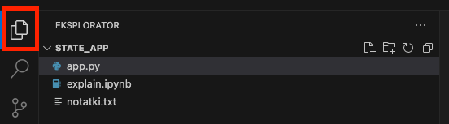

* lub `ctrl + b` (jednocześnie kliknij `ctrl` i `b`) w Windows
* lub `cmd + b` w Macos (jednocześnie kliknij `cmd` i `b`)

## **Jak otwierać folder w Visual Studio Code?**

Aby otworzyć folder w Visual Studio Code:

* w górnym pasku menu kliknij `Plik` > `Otwórz folder`
* wybierz folder, który chcesz otworzyć (ale w niego nie wchodź)
* kliknij `Otwórz`

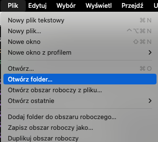

## **Jak otwierać terminal w Visual Studio Code?**

Aby otworzyć terminal w Visual Studio Code:

* w górnym pasku menu kliknij `Terminal` > `Nowy Terminal`

## **Jak dodawać pliki w Visual Studio Code?**

Aby dodać plik w Visual Studio Code:

* kliknij ikonę nowego pliku w Eksploratorze plików i folderów

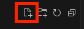

* wpisz nazwę pliku
* naciśnij `Enter`

Alternatywnie:

* kliknij prawym przyciskiem myszy na folderze w Eksploratorze
* wybierz `Nowy plik`
* wpisz nazwę pliku
* naciśnij `Enter`

## **Jak dodawać foldery w Visual Studio Code?**

Aby dodać folder w Visual Studio Code:

* kliknij ikonę nowego folderu w Eksploratorze plików i folderów

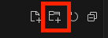

* wpisz nazwę folderu
* naciśnij `Enter`

Alternatywnie:

* kliknij prawym przyciskiem myszy na folderze w Eksploratorze
* wybierz `Nowy folder`
* wpisz nazwę folderu
* naciśnij `Enter`

## **Jak korzystać z palety poleceń w Visual Studio Code?**

Paleta poleceń to narzędzie, które pozwala na szybkie wyszukiwanie i uruchamianie poleceń w Visual Studio Code.

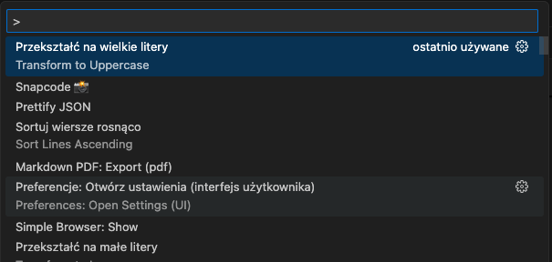

Aby otworzyć paletę poleceń w Visual Studio Code:

* w górnym pasku menu kliknij `Wyświetl` > `Paleta Poleceń`
* lub wciśnij `ctrl + shift + p` (jednocześnie kliknij `ctrl`, `shift` i `p`) w Windows
* lub `cmd + shift + p` w Macos (jednocześnie kliknij `cmd`, `shift` i `p`)

## **Jak zainstalować plugin/rozszerzenie w Visual Studio Code?**

Aby dodać nowy plugin (rozszerzenie) w Visual Studio Code:

1. **Otwórz Panel Rozszerzeń**
    * W lewym bocznym panelu znajduje się ikona „Rozszerzenia” (Extensions), która wygląda jak mała ikona z czterema kwadratami. Kliknij ją.
    * Alternatywnie możesz użyć skrótu klawiszowego Ctrl + Shift + X (Windows/Linux) lub Cmd + Shift + X (macOS), aby otworzyć Panel Rozszerzeń.

    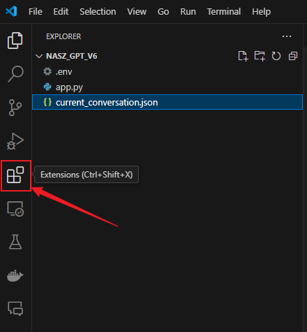

1. **Wyszukaj Plugin (Rozszerzenie)**
    * W polu wyszukiwania, które znajduje się na górze panelu Rozszerzeń, wpisz nazwę pluginu, który chcesz zainstalować.
    * Visual Studio Code przeszuka dostępne rozszerzenia w marketplace i wyświetli wyniki poniżej.

    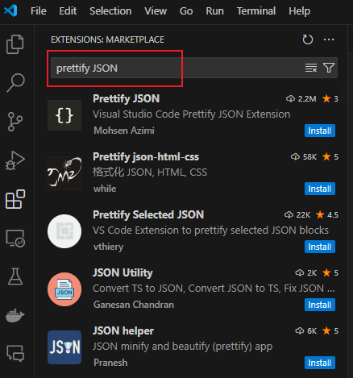

1. **Wybierz Plugin**
    * Kliknij na wybrane rozszerzenie z listy wyników wyszukiwania, aby zobaczyć więcej szczegółów na jego temat, takie jak opis, liczba pobrań i oceny.

    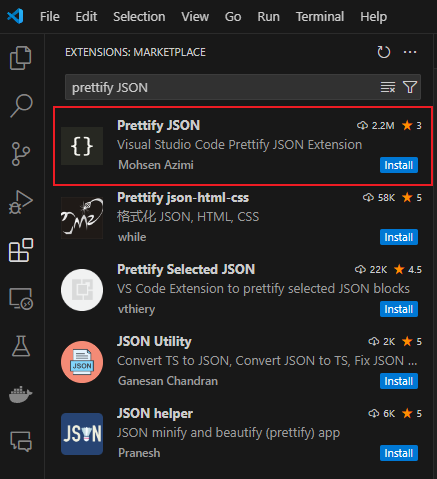

1. **Zainstaluj Plugin**
    * Po prawej stronie panelu, po kliknięciu na rozszerzenie, zobaczysz przycisk „Install”. Kliknij ten przycisk, aby rozpocząć instalację.
    * Po kilku sekundach (w zależności od wielkości rozszerzenia i prędkości internetu), rozszerzenie zostanie zainstalowane.

    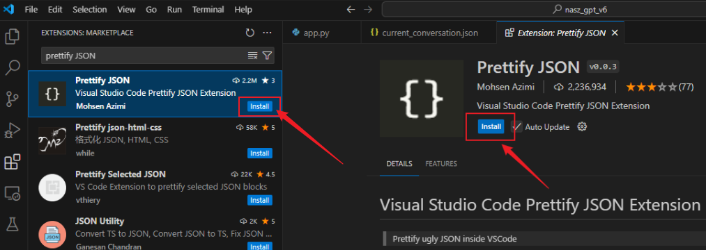

1. **Zrestartuj Visual Studio Code (jeśli wymagane)**
    * Niektóre rozszerzenia mogą wymagać ponownego uruchomienia Visual Studio Code, aby zadziałały poprawnie. Jeśli pojawi się takie powiadomienie, zamknij i ponownie uruchom program.

1. **Sprawdź Zainstalowany Plugin**
    * Po zainstalowaniu, rozszerzenie będzie widoczne w sekcji „Zainstalowane” w Panelu Rozszerzeń.
    * Możesz teraz używać zainstalowanego rozszerzenia w swoim projekcie.