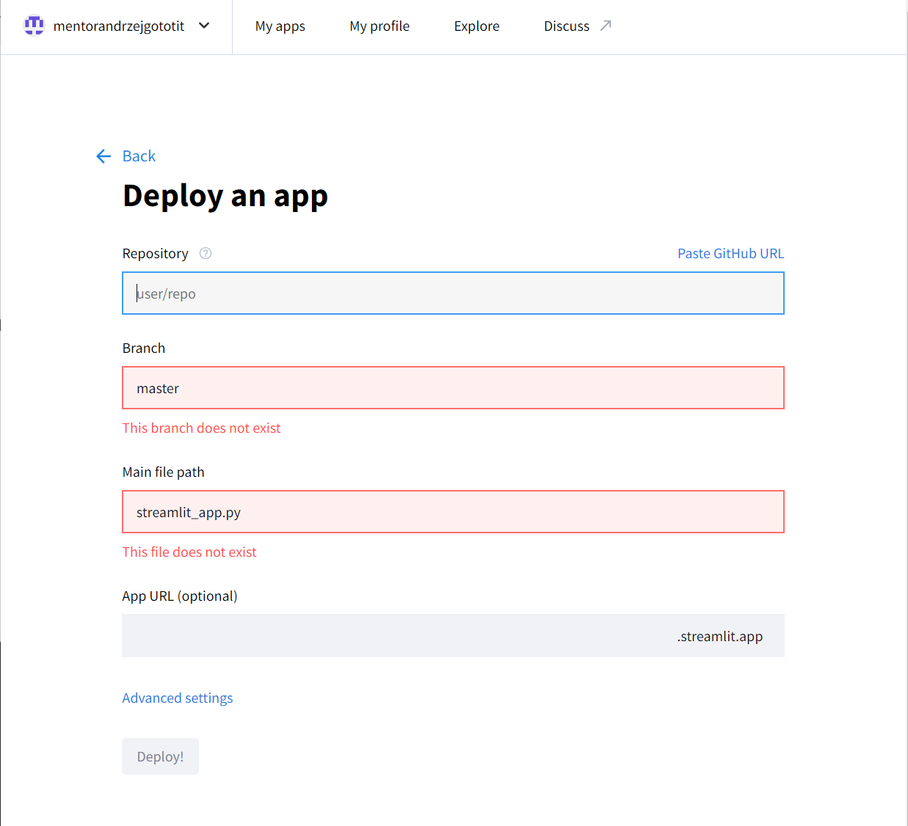
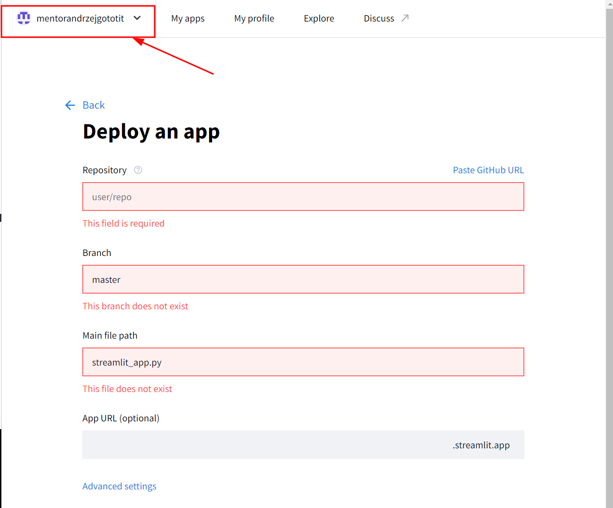
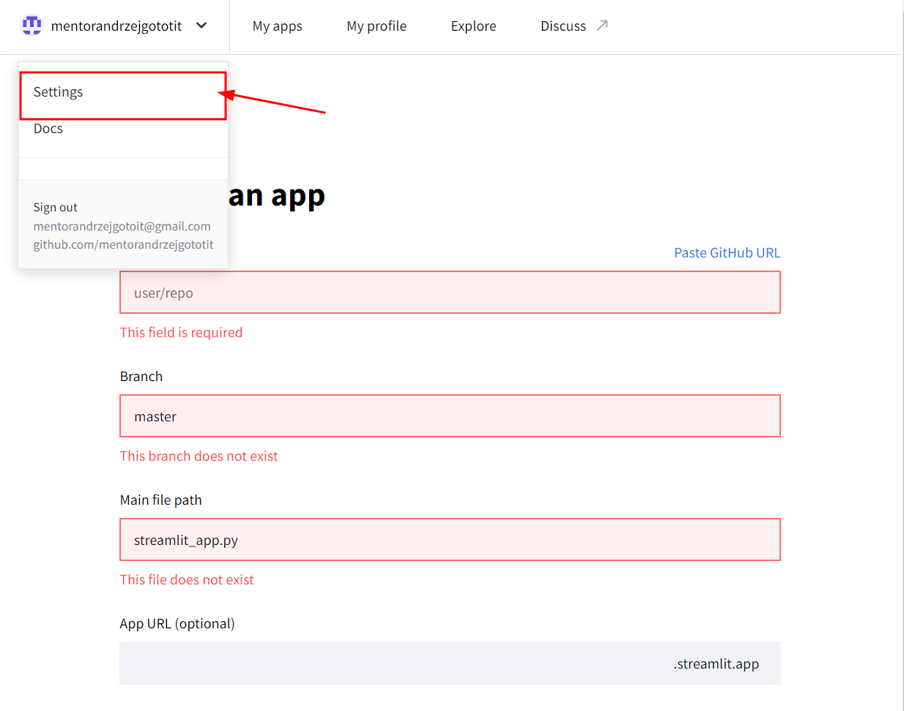
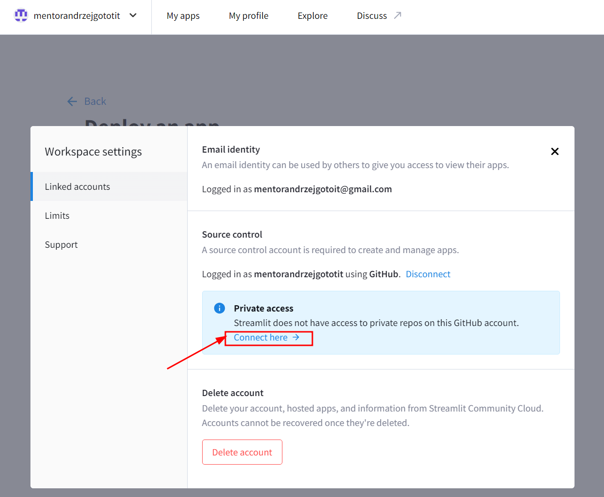
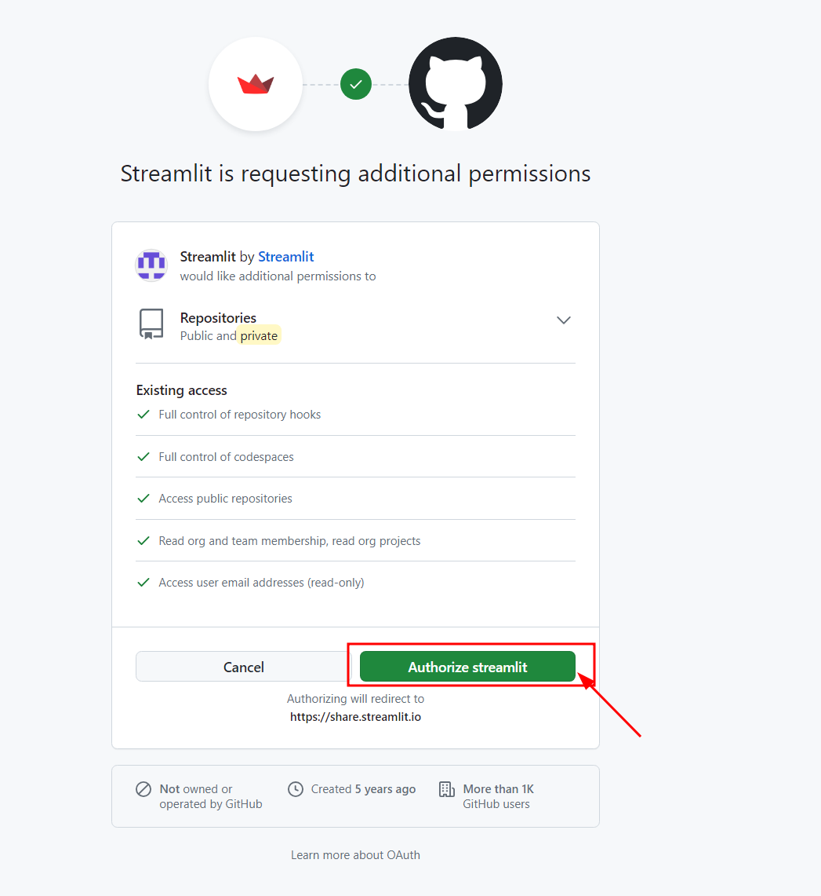
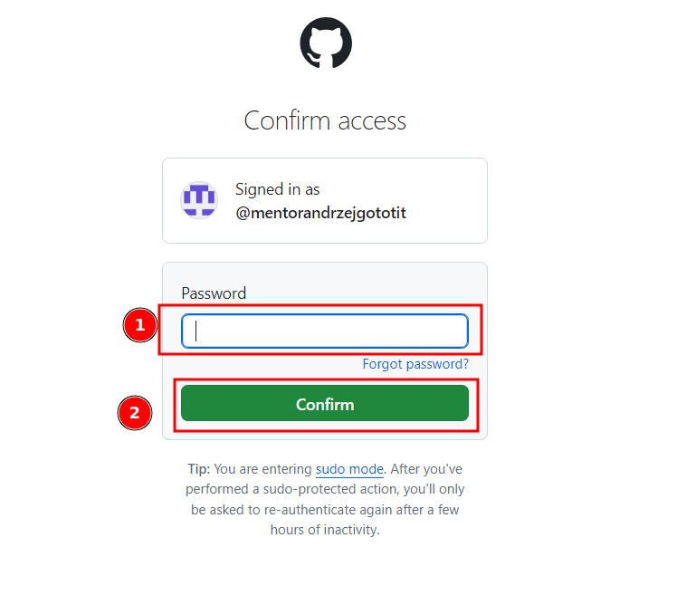
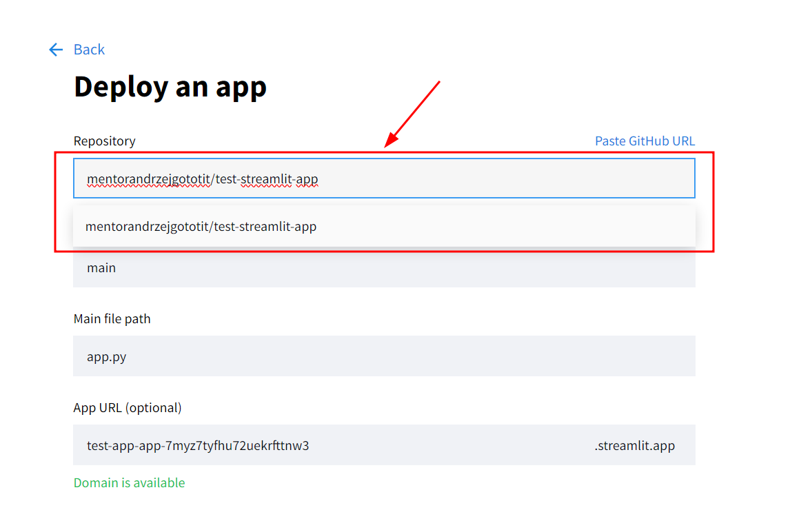

---
tags:
    - Streamlit Community Cloud
    - Moduł 6
    - wdrożenie
    - repozytorium
    - deploy
---

# **Streamlit Community Cloud - problemy**

**Streamlit Community Cloud** to platforma, która pozwala na wdrożenie aplikacji stworzonych w Streamlit. Poniżej znajdziesz rozwiązania na najczęściej pojawiające się problemy związane z tą platformą.

## **Podczas wdrażania aplikacji nie widzę mojego repozytorium**

Przy próbie wdrożenia aplikacji, kiedy klikam `Create App` i klikam w pole `Repository` nic mi się nie wyświetla, a później
inne pola świecą się na czerwono

1. **Kliknij w swoją nazwę w lewym górnym rogu**

1. **Z menu wybierz `Settings`**

1. **W niebieskiej ramce w sekcji `Private access` kliknij `Connect here`**

1. **Następnie kliknij zielony przycisk `Authorize streamlit`**

1. **Potwierdź wpisując hasło do konta GitHub i kliknij zielony przycisk `Confirm`**

1. Po wykonaniu tych operacji kiedy **odświeżymy stronę** i klikniemy w pole tekstowe `Repository`, wyświetli się nam link do naszego repozytorium ( lub repozytoriów jeśli jest
ich więcej)
