---
tags:
    - Moduł 9
    - Digital Ocean
    - Chmura
    - Cloud
---
# **Digital Ocean - rejestracja i konfiguracja**

**DigitalOcean** to platforma chmurowa, która umożliwia użytkownikom tworzenie i zarządzanie serwerami wirtualnymi (nazywanymi "dropletami"). Jest skierowana głównie do programistów i małych firm, oferując prostą i intuicyjną obsługę. Użytkownicy mogą uruchamiać na niej aplikacje, strony internetowe czy bazy danych, korzystając z elastycznych zasobów chmury. Dzięki temu można skalować infrastrukturę w zależności od potrzeb. DigitalOcean jest ceniona za przystępność, szybkie wdrożenia oraz transparentne modele kosztów.

## **Jak założyć konto w Digital Ocean?**

1. Wejdź na stronę [digitalocean.com](https://m.do.co/c/1d69c2e45097) przez link [https://m.do.co/c/1d69c2e45097](https://m.do.co/c/1d69c2e45097)

    !!! info "Ważne"

        To ważne, aby użyć powyższego linku, żeby dostać darmowe kredyty 

    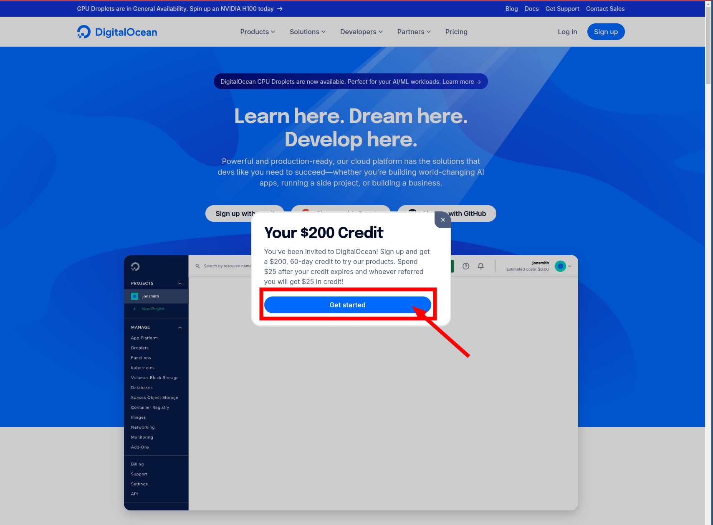

1. Wybierz `GitHub` jako formę autoryzacji do Digital Ocean. Aby to zrobić kliknij **Sign Up with GitHub**

    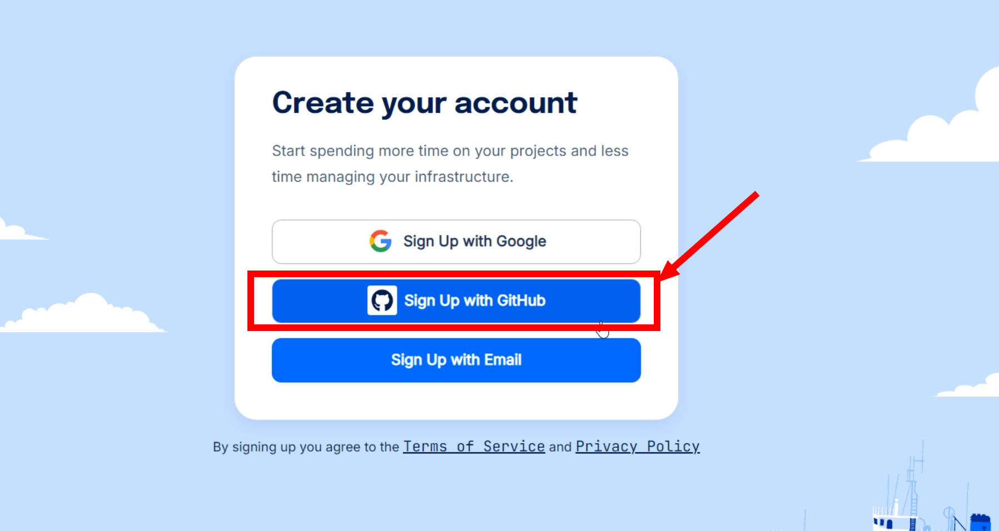

1. Autoryzuj Digital Ocean,aby mogło używać `GitHub` żeby Cię logować. Aby to zrobić kliknij zielony guzik **Authorize digitalocean**

    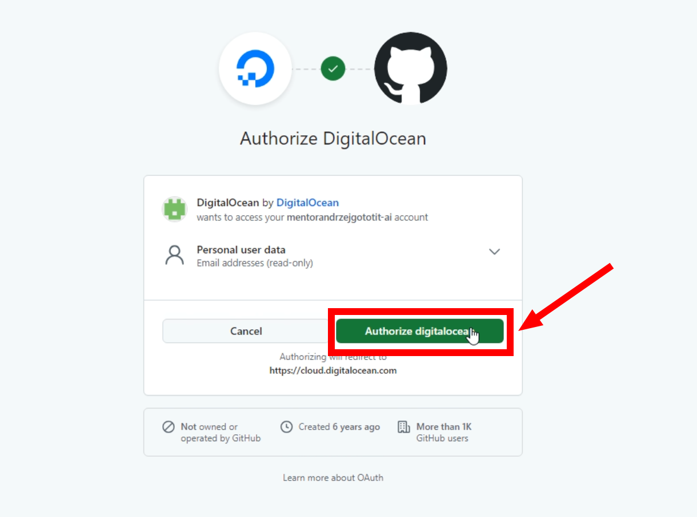

1. Wypełnij ankietę. Najlepiej w taki sposób, jak zaprezentowano na poniższym zrzucie ekranu, a następnie kliknij **Submit**

    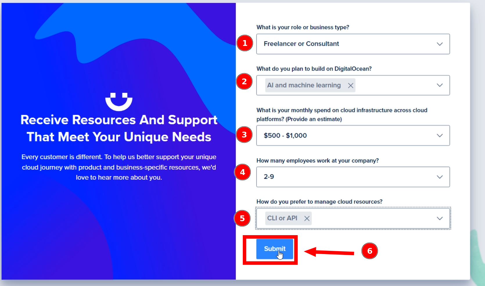

1. Mimo, że otrzymujemy od Digital Ocean darmowe 100$, żeby się pobawić ich chmurą, musimy podpiąć kartę. Wypełnij dane karty i kliknij **Save and Sign Up**

    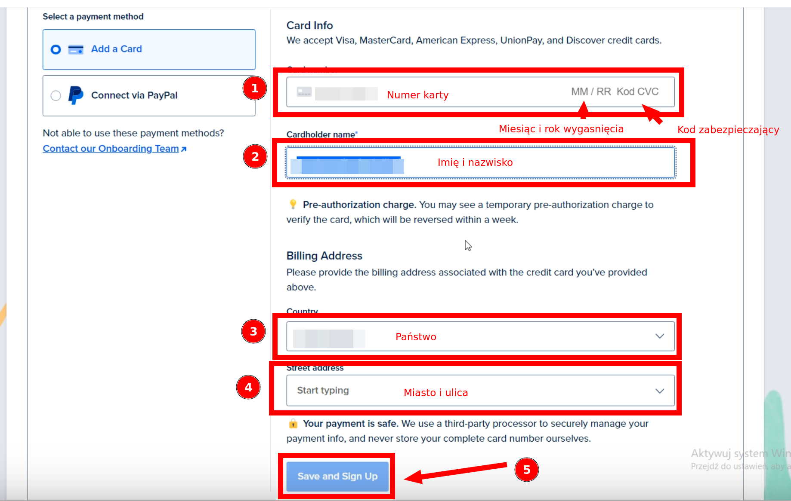

1. Jeśli po weryfikacji zobaczymy ekran powitalny, to oznacza, że wszystko poszło w porządku. W celu przejścia do konsoli Digital Ocean, należy wcisnąć przycisk **Explore our Control Panel**

    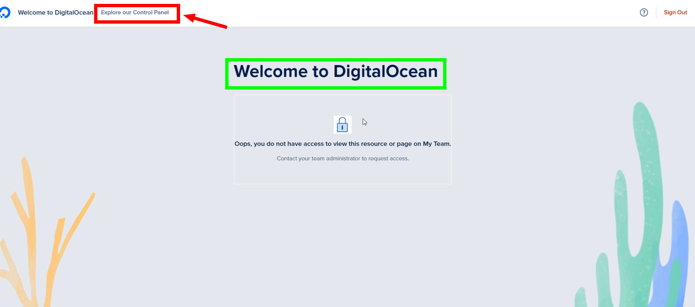

1. Ekran konsoli Digital Ocean

    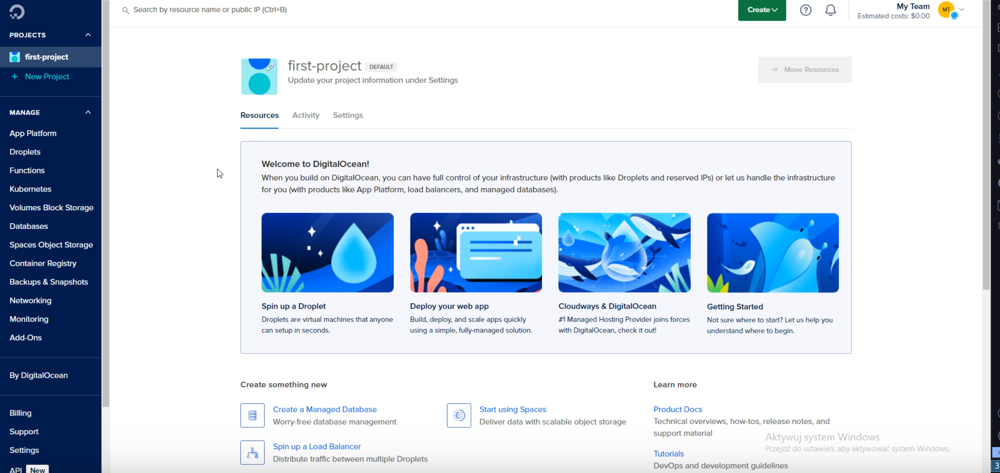

## **Jak się zalogować do Digital Ocean?**

1. Wejdź na stronę logowania [https://cloud.digitalocean.com/login](https://cloud.digitalocean.com/login)

1. Tutaj istnieją 2 możliwości:
    1. Jeśli przeglądarka pamięta jeszcze ostatnią sesję, to zobaczysz ekran, na którym możesz potwierdzić, że chcesz wrócić do tej sesji. 
    W tym scenariuszu kliknij w guzik **Sign In with GitHub**

    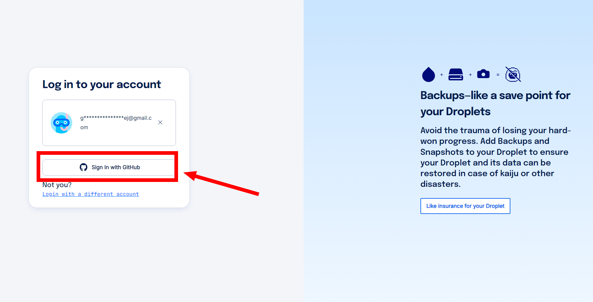

    1. Jeśli Twoja poprzednia sesja nie jest zapisana, wówczas wybierz ten sam sposób logowania, ten sam który został wybrany przy rejestracji.
    Moim wyborem podczas prowadzenia lekcji był `GitHub`. Jeśli był to
    również Twój wybór, to kliknij **Sign In with GitHub**

    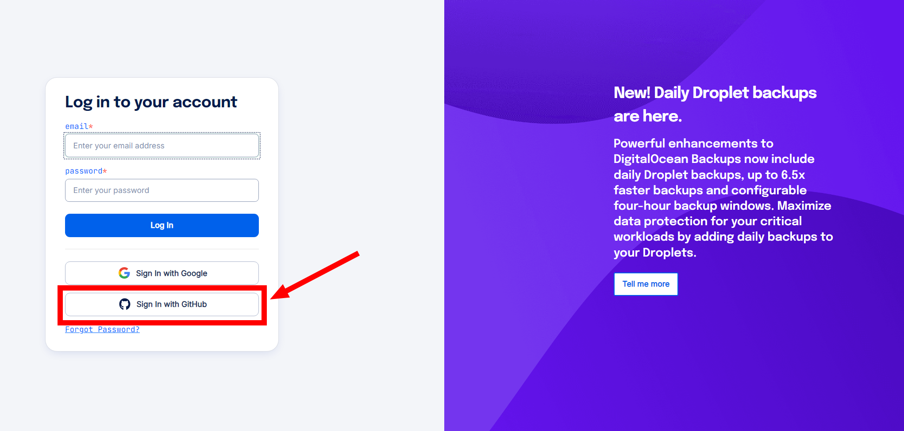

## **Jak usunąć konto Digital Ocean?**

1. Zaloguj się do konsoli Digital Ocean, tak jak w instrukcji wyżej.
1. Kliknij w swój awatar, znajdujący się w prawym górnym rogu konsoli

    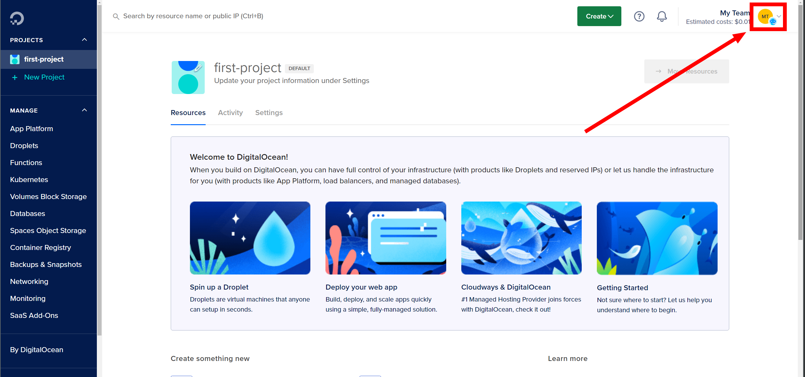

1. Następnie z menu wybierz **My Account**

    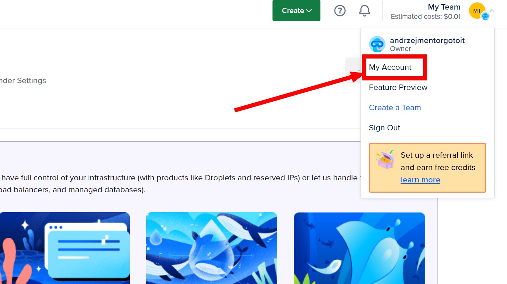

1. Nawiguj na dół strony i kliknij guzik **Deactivate** znajdujący się w prawym dolnym rogu

    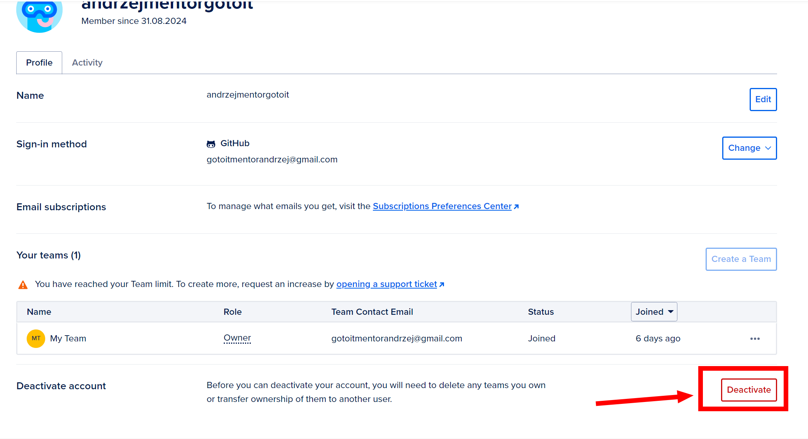

1. Następnie, na kolejnym ekranie zaznacz **Purge my account data** i potwierdź usunięcie klikając przycisk **Delete Account and Purge Data**

    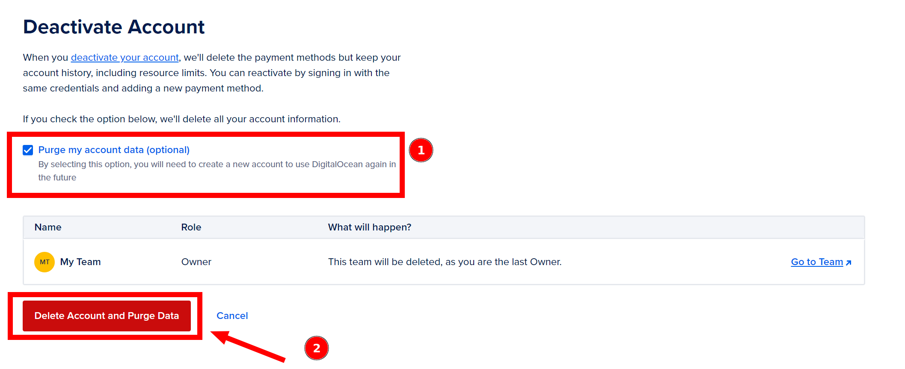
