---
tags:
    - KeyError
    - PDF
    - nbconvert
    - Pandoc
    - MikTeX
---

# **Różne - inne pytania i problemy**

## **Gdy próbuję wyciągnąć jakąś kolumnę z DataFrame dostaję błąd `KeyError`**


Podczas tworzenia kolumny z ilością mężczyzn w aplikacji prezentującej dane z półmaratonu wrocławskiego, otrzymuję błąd **`KeyError: Płeć`**:


W tym przypadku błąd `KeyError` wskazuje na brak kolumny `Płeć` w Twoim DataFrame.

* Błąd taki może wystąpić, gdy próbujesz odwołać się do kolumny, która nie istnieje w Twoim DataFrame. Upewnij się, że nazwa kolumny jest poprawna i zgodna z nazwą kolumny w Twoim DataFrame. Możesz sprawdzić nazwy kolumn w DataFrame, korzystając z metody `columns`:

    ```python
    df.columns
    ```

* Może to wynikać również z faktu, że dane zostały wczytane z pliku .csv z domyślnym separatorem - przecinkiem (`,`), podczas gdy plik ten używa separatorów w postaci średników (`;`). Upewnij się, że na końcu polecenia `pd.read_csv` dodałeś argument `sep=";"`, aby poprawnie określić separator danych:

    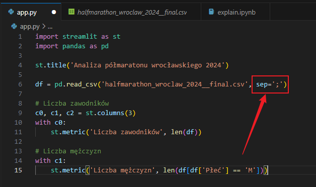

## **Gdy próbuję eksportować notebooka do PDF dostaję błąd `nbconvert failed: Pandoc wasn't found`**

Jeżeli próbujesz wyeksportować notebooka do PDF i dostajesz błąd:

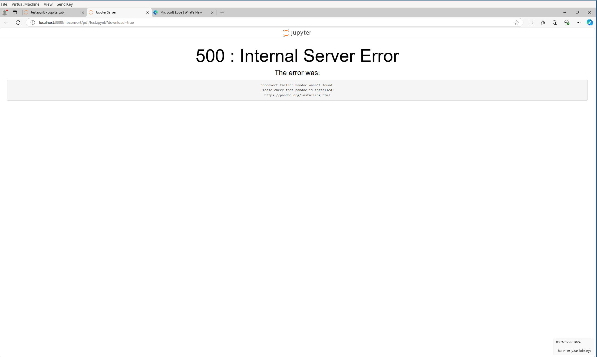

Wówczas będziemy musieli zainstalować dwie biblioteki: `pandoc` oraz `MikTeX`.

Aby zainstalować `pandoc`:

- Przechodzimy na stronę [https://pandoc.org/installing.html](https://pandoc.org/installing.html)
- I wykonujemy następujące kroki:


Aby zainstalować `MikTeX`:
- Przechodzimy na stronę [https://miktex.org/download](https://miktex.org/download)
- I wykonujemy następujące kroki:

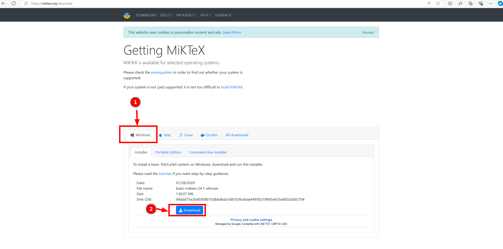
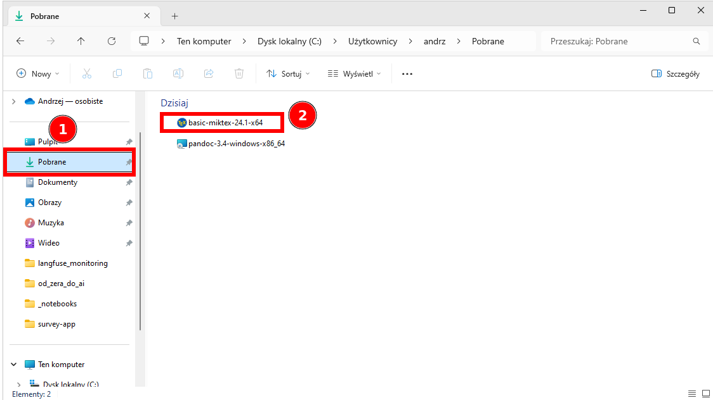
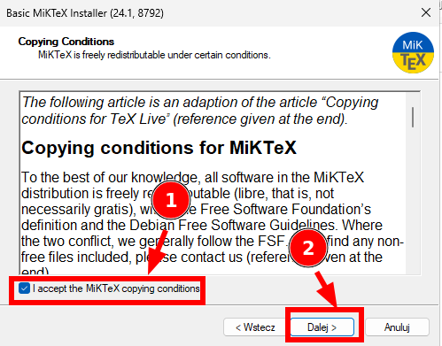
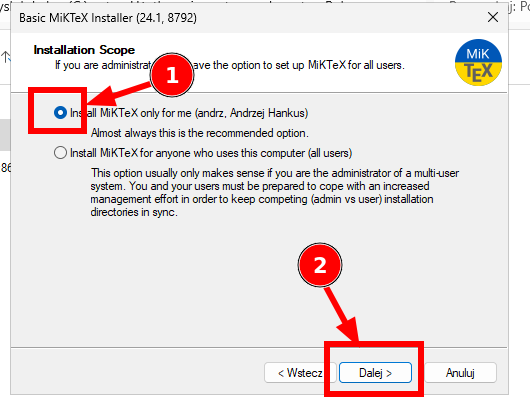

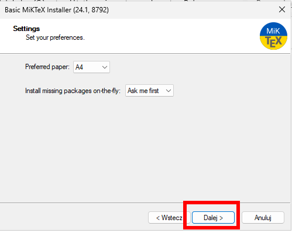

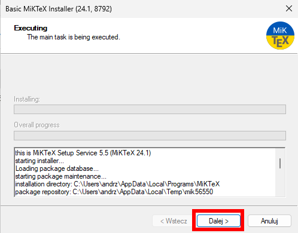
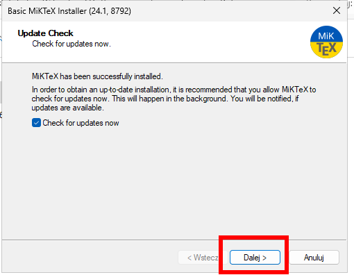


- Uruchamiamy ponownie `Anaconda Prompt`, następnie `jupyter lab` i próbujemy ponownie wyeksportować notebooka do PDF. W tym momencie zostaniemy poproszeni o doinstalowanie dodatkowych pakietów, klikamy `Install`:

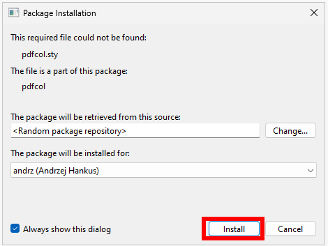


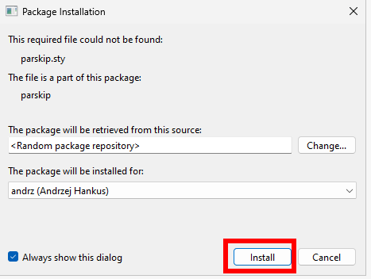
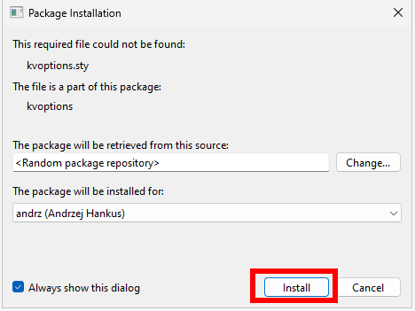


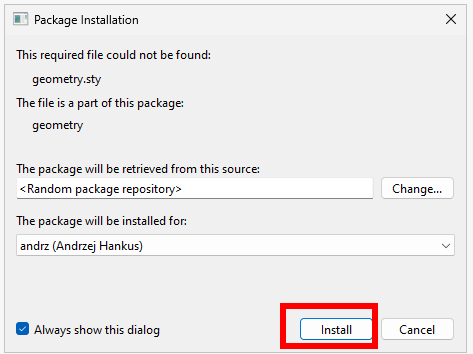


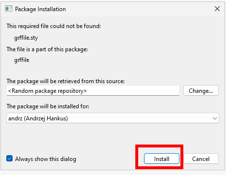


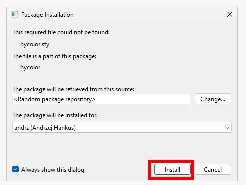


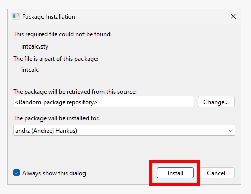