---
tags:
    - KeyError
    - PDF
    - nbconvert
    - Pandoc
    - MikTeX
---

# **Różne - inne pytania i problemy**


## **Gdy próbuję wyciągnąć jakąś kolumnę z DataFrame dostaję błąd `KeyError`**

Podczas tworzenia kolumny z ilością mężczyzn w aplikacji prezentującej dane z półmaratonu wrocławskiego, otrzymuję błąd **`KeyError: Płeć`**:

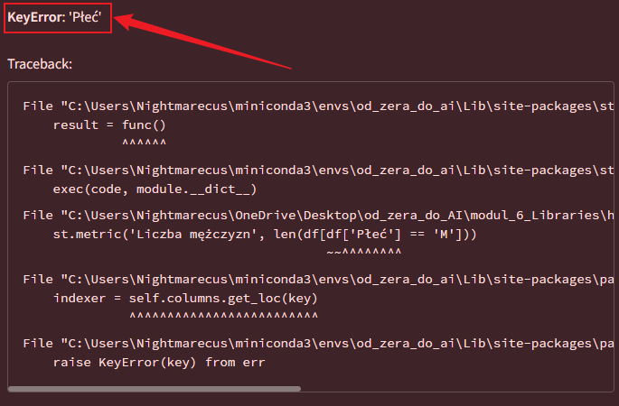

W tym przypadku błąd `KeyError` wskazuje na brak kolumny `Płeć` w Twoim DataFrame.

* Błąd taki może wystąpić, gdy próbujesz odwołać się do kolumny, która nie istnieje w Twoim DataFrame. Upewnij się, że nazwa kolumny jest poprawna i zgodna z nazwą kolumny w Twoim DataFrame. Możesz sprawdzić nazwy kolumn w DataFrame, korzystając z metody `columns`:

    ```python
    df.columns
    ```

* Może to wynikać również z faktu, że dane zostały wczytane z pliku .csv z domyślnym separatorem - przecinkiem (`,`), podczas gdy plik ten używa separatorów w postaci średników (`;`). Upewnij się, że na końcu polecenia `pd.read_csv` dodałeś argument `sep=";"`, aby poprawnie określić separator danych:

    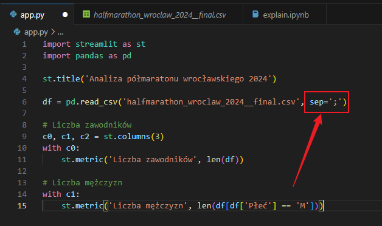


## **Błąd `conda is not recognized` w terminalu VS Code**

Problem występuje podczas próby aktywacji środowiska wirtualnego conda w terminalu VS Code. System wyświetla komunikat:

```
The term 'conda' is not recognized as the name of a cmdlet, function, script file, or operable program.
```

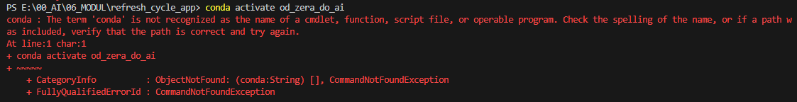

**Przyczyna:**
Terminal VS Code nie ma skonfigurowanego dostępu do poleceń conda, ponieważ PowerShell nie został zainicjalizowany z Anacondą.

**Rozwiązanie:**

**Metoda 1 - Restart terminala:**

1. Zamknij terminal w VS Code (kliknij ikonę kosza).
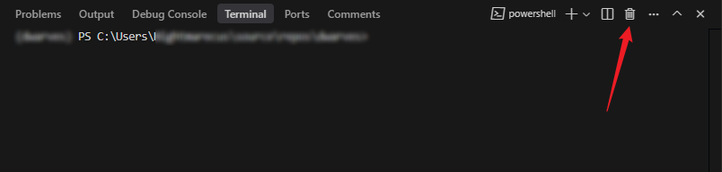
2. Otwórz nowy terminal i poczekaj kilka sekund na pełne wczytanie.
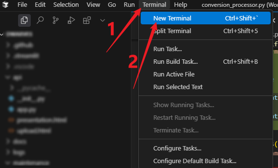
3. Spróbuj ponownie aktywować środowisko.

**Metoda 2 - Inicjalizacja conda (jeśli metoda 1 nie pomogła):**

1. Zamknij VS Code.
2. Otwórz **Anaconda Prompt**.
3. Aktywuj swoje środowisko wirtualne:
   ```bash
   conda activate nazwa_środowiska
   ```
4. Wykonaj inicjalizację PowerShell:
   ```bash
   conda init powershell
   ```
5. Uruchom ponownie VS Code.
6. Otwórz terminal i spróbuj aktywować środowisko.


## **Mapa cieplna wyświetla się bez wartości numerycznych**

Problem występuje podczas generowania mapy cieplnej w bibliotece `seaborn` - wizualizacja jest tworzona poprawnie, ale brakuje na niej wartości numerycznych w poszczególnych komórkach:

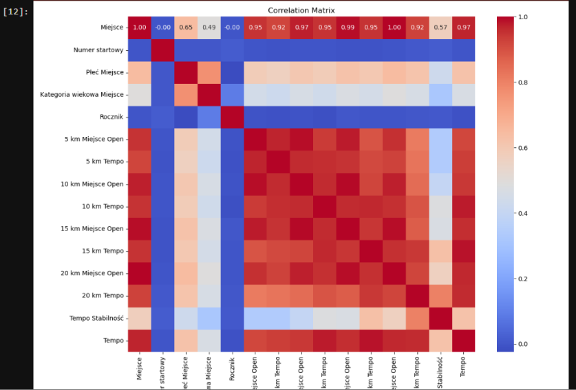

**Przyczyna:**
Brak wartości numerycznych w mapie cieplnej wynika z wykorzystywania starszej wersji biblioteki `seaborn`.

**Rozwiązanie:**

1. Wykonaj poniższą komendę w komórce notebooka, aby zaktualizować bibliotekę `seaborn`:

    ```python
    !pip install --upgrade seaborn
    ```

2. Po zakończeniu instalacji zrestartuj kernel Jupyter, aby zmiany zostały zastosowane.

3. Uruchom ponownie kod tworzący mapę cieplną - wartości numeryczne powinny się teraz wyświetlać poprawnie.


## **Błąd `JSONDecodeError` podczas uruchamiania aplikacji Streamlit**

Problem występuje podczas uruchamiania aplikacji Streamlit. System wyświetla komunikat błędu:

```
json.decoder.JSONDecodeError: Expecting value: line 1 column 1 (char 0)
```

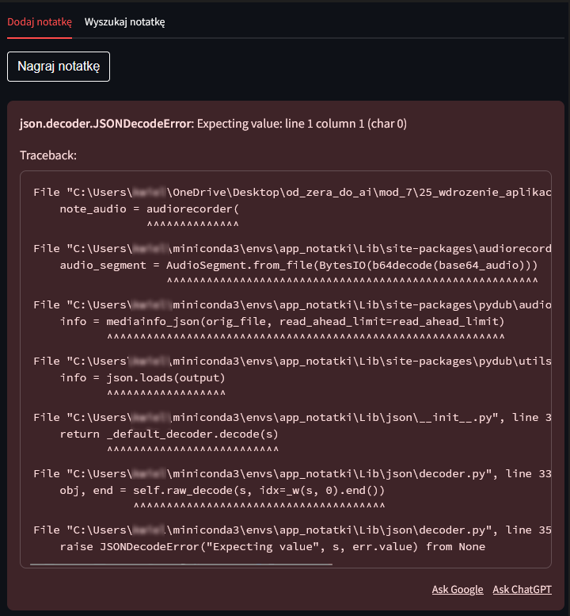

**Przyczyna:**
Błąd wynika z konfliktu wersji biblioteki `ffmpeg` z innymi zależnościami w projekcie. Nowsze wersje `ffmpeg` mogą powodować niekompatybilność z komponentami multimedialnymi Streamlit.

**Rozwiązanie:**

1. Upewnij się, że masz aktywne odpowiednie środowisko wirtualne.

2. Zainstaluj kompatybilną wersję biblioteki `ffmpeg` za pomocą `conda`:

    ```bash
    conda install -c conda-forge ffmpeg=6.1.1
    ```

3. Zamknij wszystkie otwarte instancje VS Code i Jupyter Notebook.

4. Uruchom ponownie środowisko programistyczne.

5. Uruchom ponownie aplikację Streamlit.

**Uwaga:** W przypadku utrzymywania się problemów spróbuj zainstalować najnowszą wersję biblioteki `ffmpeg`:

```bash
conda install -c conda-forge ffmpeg
```


## **Błąd `AttributeError: 'ThreadLocalVariable' object has no attribute 'copy'` podczas uruchamiania PyCareta**

Problem występuje podczas inicjalizacji środowiska PyCareta za pomocą funkcji `setup()`. Błąd ma postać:

```
AttributeError: 'ThreadLocalVariable' object has no attribute 'copy'
```

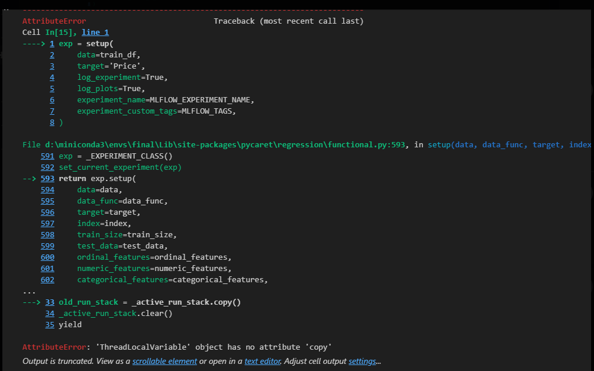

**Przyczyna:**
Błąd wynika z konfliktów między wersjami bibliotek `mlflow` i `PyCaret`, które korzystają z niekompatybilnych wersji zależności.

**Rozwiązanie:**

1. Upewnij się, że masz aktywne odpowiednie środowisko wirtualne.

2. Zainstaluj kompatybilną wersję biblioteki `mlflow` za pomocą `conda`:

    ```bash
    conda install -c conda-forge mlflow=2.16.2
    ```

3. Po instalacji zamknij wszystkie otwarte instancje VS Code i Jupyter, a następnie uruchom je ponownie, aby zmiany zostały prawidłowo zastosowane.

4. Uruchom ponownie komórkę z funkcją `setup()` w PyCaret.

**Uwaga:** W przypadku utrzymywania się problemów spróbuj zaktualizować biblioteki `MLflow` i `PyCaret` do najnowszych wersji:

```bash
pip install --upgrade mlflow pycaret
```


## **Błąd `generated_jit` w bibliotece Numba**

Problem występuje podczas uruchamiania komórki notebooka w Jupyter Lab. System wyświetla komunikat błędu:

```
AttributeError: module 'numba' has no attribute 'generated_jit'
```


**Przyczyna:**
Błąd wynika z użycia niekompatybilnej wersji biblioteki `numba`. Atrybut `generated_jit` został usunięty w nowszych wersjach Numba, co powoduje konflikt z kodem lub innymi bibliotekami oczekującymi starszej wersji.

**Rozwiązanie:**

1. Upewnij się, że masz aktywne odpowiednie środowisko wirtualne.

2. Zainstaluj kompatybilną wersję biblioteki `numba`:

    ```bash
    pip install numba==0.58.1
    ```

3. Zrestartuj kernel Jupyter.

4. Uruchom ponownie komórkę z błędem.

**Uwaga:** W przypadku utrzymywania się problemów spróbuj zaktualizować bibliotekę `Numba` do najnowszej wersji:

```bash
pip install --upgrade numba
```

## **Problemy z wyświetlaniem interaktywnych widgetów Jupyter**

Problem występuje podczas używania interaktywnych elementów (widgetów) w Jupyter Notebook/Lab. Widgety mogą nie wyświetlać się poprawnie lub wyświetlać komunikaty o błędach.

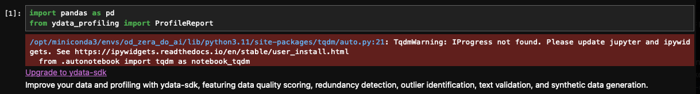

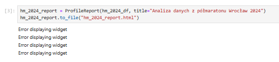

**Przyczyna:**
Błąd wynika z nieaktualnej lub niekompatybilnej wersji biblioteki `ipywidgets`, która jest odpowiedzialna za renderowanie interaktywnych elementów w środowisku Jupyter. Może to być spowodowane:

- Konfliktem wersji między `ipywidgets` a środowiskiem Jupyter
- Brakiem odpowiednich rozszerzeń w Jupyter
- Problemami z JavaScript w przeglądarce

**Rozwiązanie:**

1. Upewnij się, że masz aktywne odpowiednie środowisko wirtualne.

2. Zaktualizuj bibliotekę `ipywidgets` do najnowszej wersji:

    ```bash
    pip install --upgrade ipywidgets
    ```

3. Zrestartuj kernel Jupyter i odśwież przeglądarkę.

4. Uruchom ponownie komórkę z widgetami.

**Dodatkowe rozwiązania:**

Jeżeli problem nadal występuje, to możesz spróbować:

- Wyczyścić cache przeglądarki i cookies dla localhost.
- Uruchomić notebook w trybie incognito przeglądarki.
- Uruchomić notebook w innej przeglądarce.


## **Błąd PyArrow w Streamlit**

Problem występuje podczas uruchamiania aplikacji Streamlit używającej niestandardowych komponentów. System wyświetla komunikat błędu:

```
streamlit.errors.StreamlitAPIException: To use Custom Components in Streamlit, you need to install PyArrow.
```

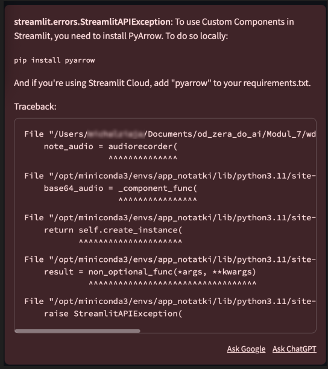

**Przyczyna:**
Błąd wystąpuje gdy aplikacja Streamlit próbuje użyć niestandardowych komponentów, ale brakuje biblioteki `PyArrow` lub została zainstalowana w niekompatybilnej wersji (np. `19.0.1`). PyArrow jest wymagana do serializacji danych między aplikacją a komponentami i zapewnia wydajną komunikację w formacie Apache Arrow.

**Rozwiązanie:**

1. Upewnij się, że masz aktywne odpowiednie środowisko wirtualne.

2. Zainstaluj kompatybilną wersję biblioteki `pyarrow`:

    ```bash
    pip install pyarrow==19.0.0
    ```

3. Uruchom ponownie aplikację Streamlit .

**Uwaga:** W przypadku utrzymywania się problemów spróbuj zainstalować najnowszą wersję biblioteki `PyArrow`:

```bash
pip install --upgrade pyarrow
```


## **Błąd `proxies` w kliencie OpenAI podczas uruchamiania Streamlit**

Problem występuje podczas uruchamiania aplikacji Streamlit wykorzystującej bibliotekę OpenAI. System wyświetla komunikat błędu:

```
TypeError: Client.__init__() got an unexpected keyword argument 'proxies'
```

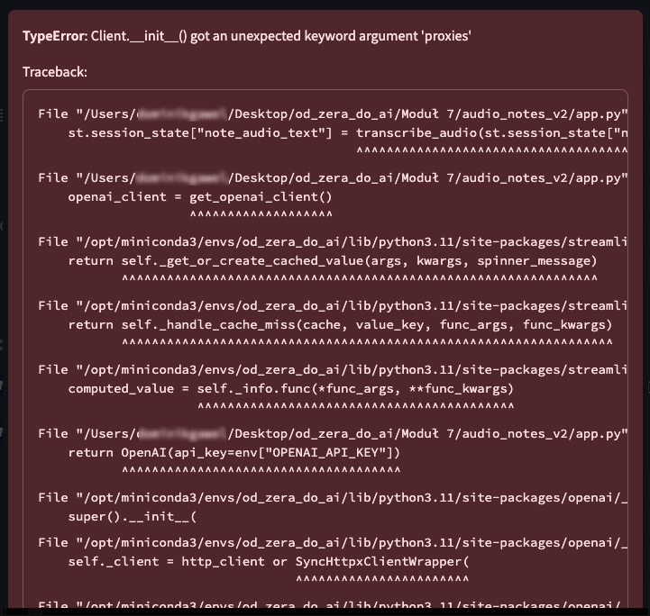

**Przyczyna:**
Błąd wystąpuje z powodu niekompatybilności między wersjami biblioteki `openai`. W starszych wersjach biblioteki OpenAI konstruktor klasy `Client` akceptował argument `proxies`, który został usunięty w nowszych wersjach. Problem może wystąpić gdy:

- Aplikacja używa starszego API OpenAI z nowszą wersją biblioteki
- Kod zawiera przestarzałe parametry inicjalizacji klienta
- Występuje konflikt między zależnościami projektu

**Rozwiązanie:**

1. Upewnij się, że masz aktywne odpowiednie środowisko wirtualne.

2. Zaktualizuj bibliotekę `openai` do najnowszej wersji:

    ```bash
    pip install --upgrade openai
    ```

3. Jeśli używasz starszego kodu, sprawdź dokumentację OpenAI i zaktualizuj inicjalizację klienta:

    ```python
    # Stary sposób (może powodować błąd)
    client = openai.Client(proxies=...)
    
    # Nowy sposób (zalecany)
    client = openai.Client()
    ```

4. Uruchom ponownie aplikację Streamlit:

    ```bash
    streamlit run nazwa_aplikacji.py
    ```

**Uwaga:** W przypadku utrzymywania się problemów sprawdź czy wszystkie zależności są zaktualizowane i zgodne z najnowszą wersją OpenAI API.

## **Błąd `DataFrameSchema` w bibliotece Pandera**

Problem występuje podczas próby użycia `DataFrameSchema` z biblioteki Pandera. System wyświetla komunikat błędu:

```
AttributeError: module 'pandera' has no attribute 'DataFrameSchema'
```

Dodatkowo podczas importu biblioteki Pandera może pojawić się ostrzeżenie:

```
UserWarning: Pandas and numpy have been removed from the base pandera dependencies. 
Please install pandas as part of your environment's dependencies or install the pandas extra with:
pip install pandas pandera
# or
pip install 'pandera[pandas]'
```

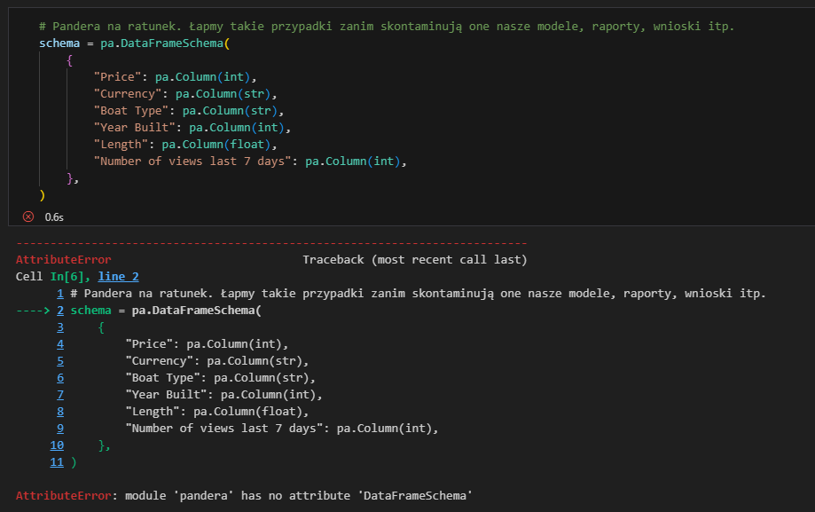
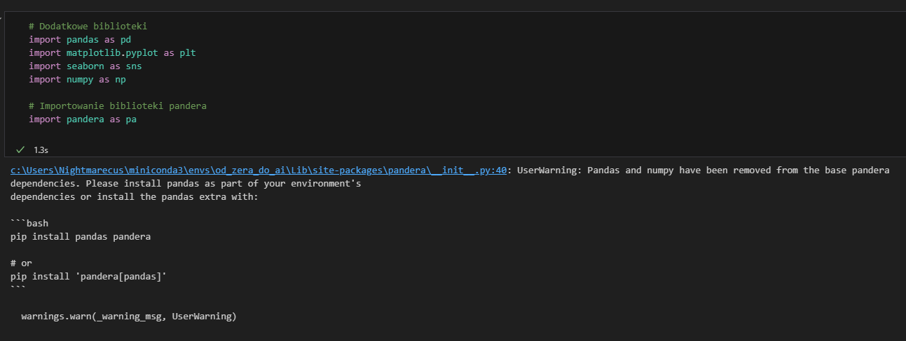

**Przyczyna:**
Błąd wystąpuje z powodu zmian w strukturze biblioteki Pandera w nowszych wersjach. Od określonej wersji biblioteki `pandas` i `numpy` nie są automatycznie instalowane jako podstawowe zależności Pandera, co powoduje:

- Brak dostępu do klasy `DataFrameSchema`
- Problemy z importowaniem komponentów związanych z DataFrames
- Niekompatybilność między wersjami Pandera a środowiskiem

**Rozwiązanie:**

1. Upewnij się, że masz aktywne odpowiednie środowisko wirtualne.

2. Zainstaluj starszą wersję Pandera (0.22.1):

    ```bash
    pip install pandera==0.22.1
    ```
3. Zrestartuj kernel Jupyter lub uruchom ponownie aplikację.


## **Gdy próbuję eksportować notebooka do PDF dostaję błąd `nbconvert failed: Pandoc wasn't found`**

Jeżeli próbujesz wyeksportować notebooka do PDF i dostajesz błąd:

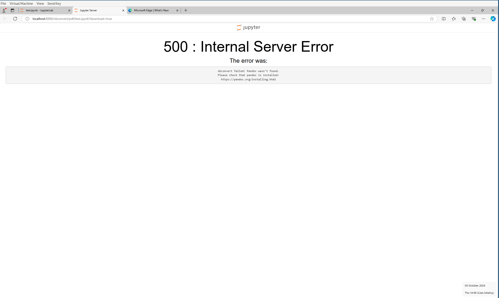

Wówczas będziemy musieli zainstalować dwie biblioteki: `pandoc` oraz `MikTeX`.

Aby zainstalować `pandoc`:

- Przechodzimy na stronę [https://pandoc.org/installing.html](https://pandoc.org/installing.html)
- I wykonujemy następujące kroki:

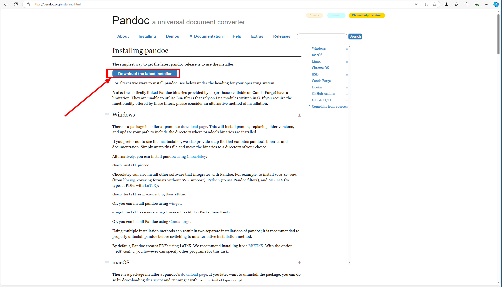
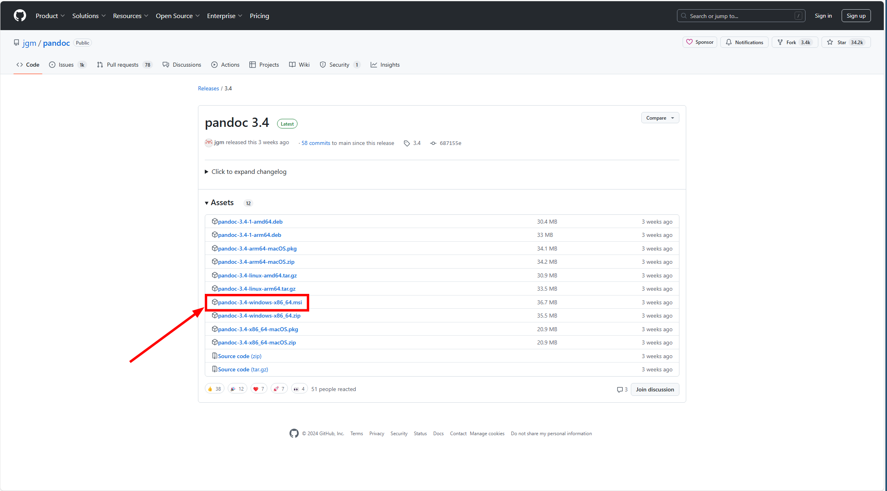
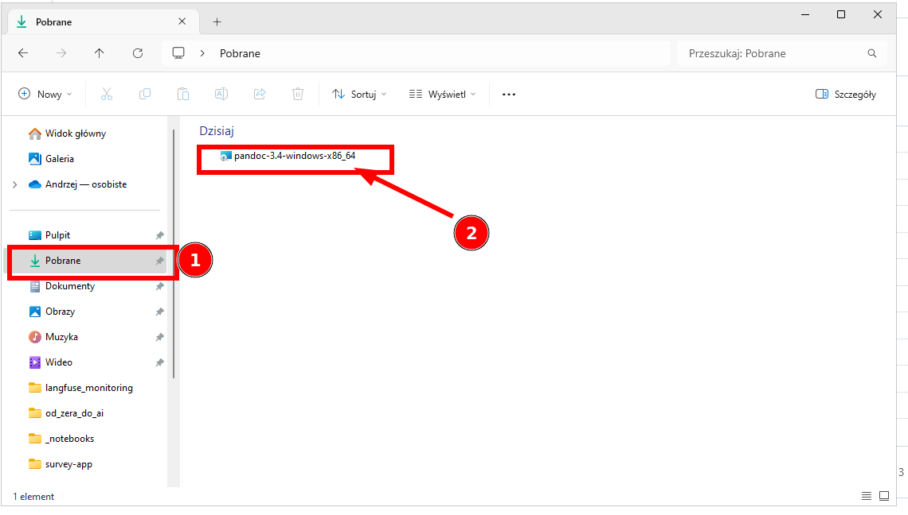

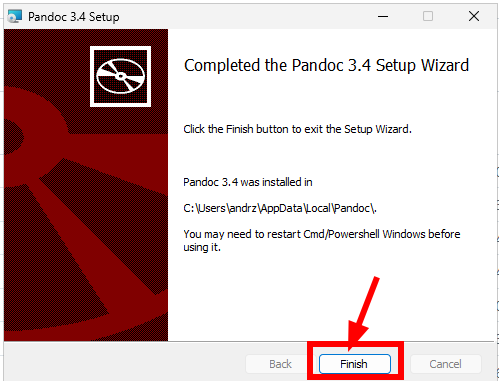

Aby zainstalować `MikTeX`:
- Przechodzimy na stronę [https://miktex.org/download](https://miktex.org/download)
- I wykonujemy następujące kroki:

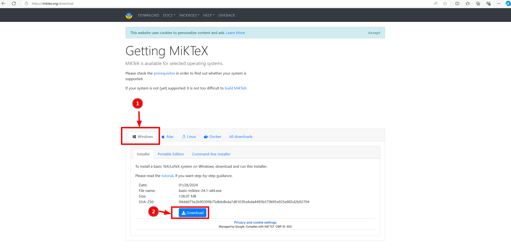
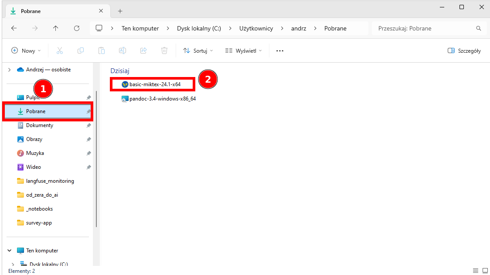
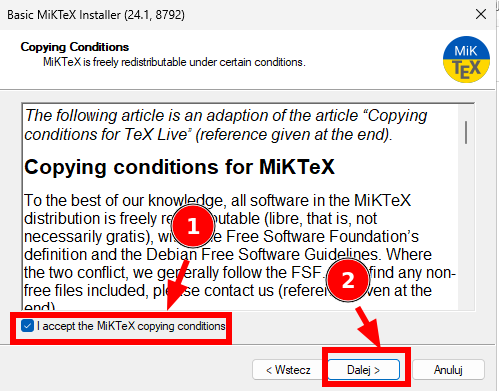
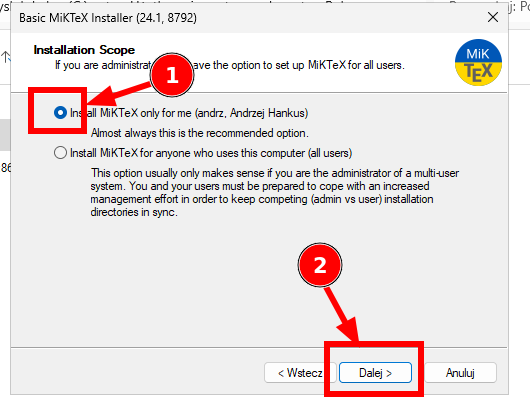
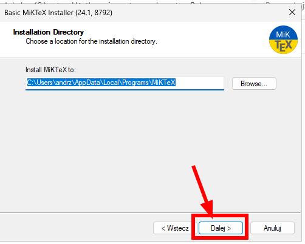
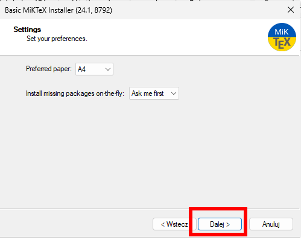
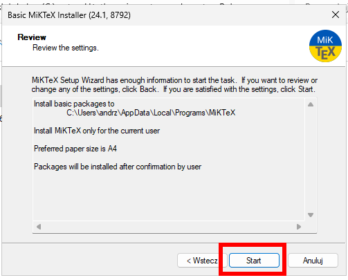
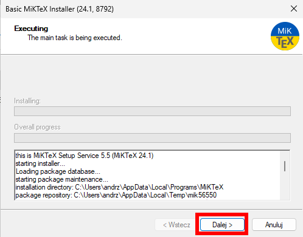
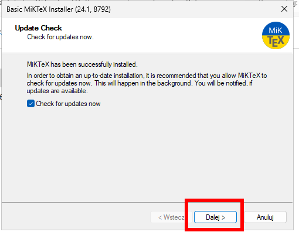
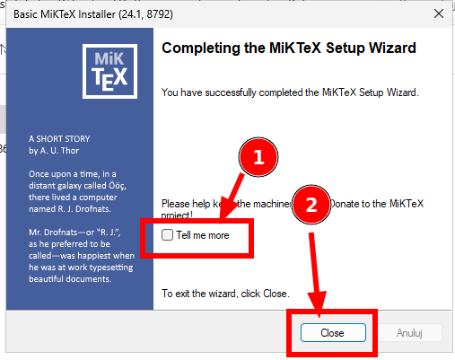

- Uruchamiamy ponownie `Anaconda Prompt`, następnie `jupyter lab` i próbujemy ponownie wyeksportować notebooka do PDF. W tym momencie zostaniemy poproszeni o doinstalowanie dodatkowych pakietów, klikamy `Install`:

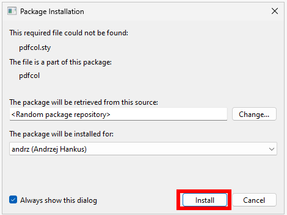
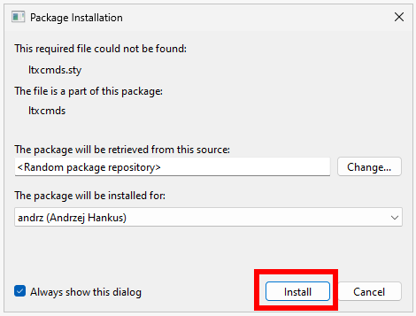


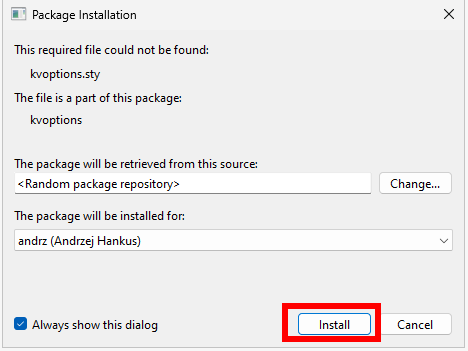
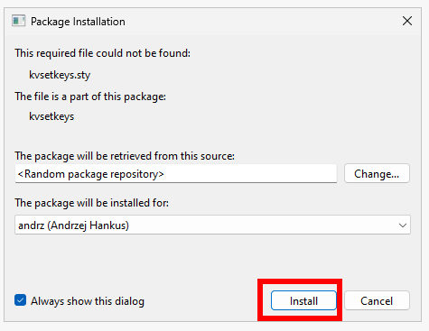
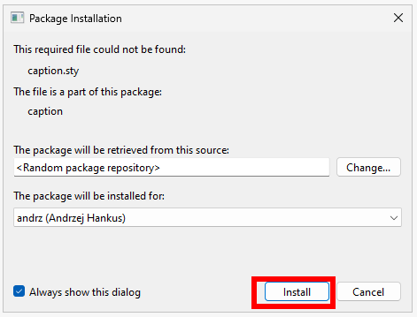
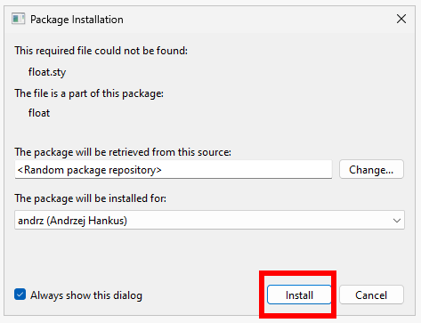
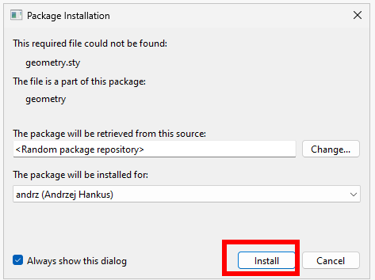
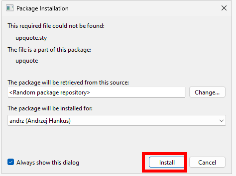
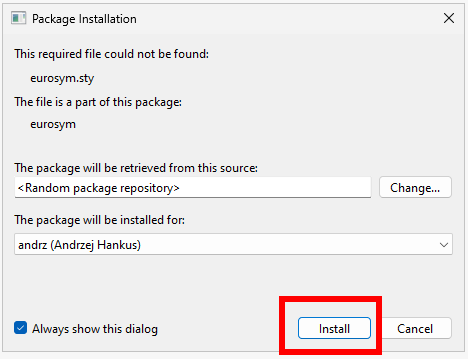
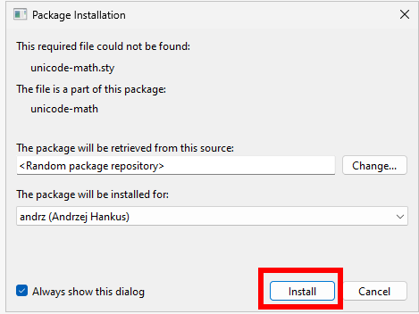
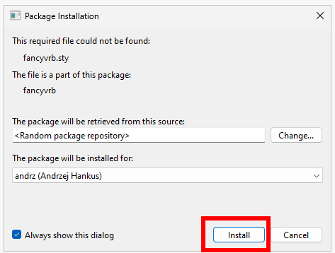
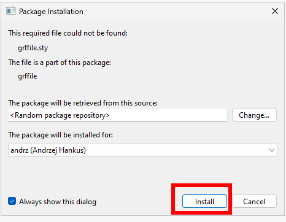
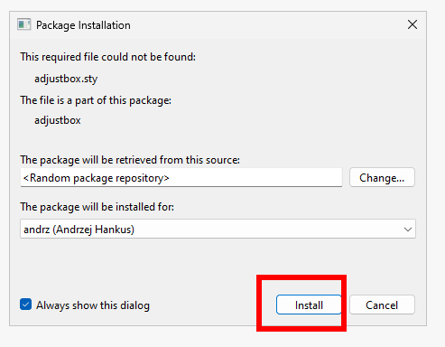
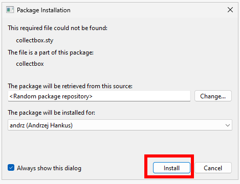
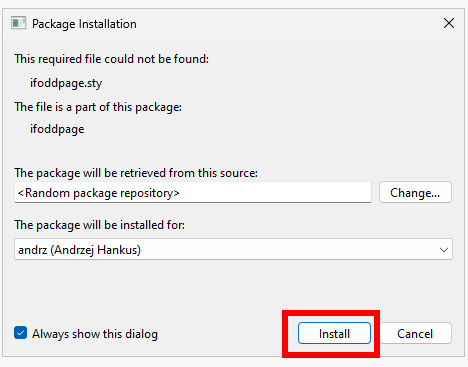
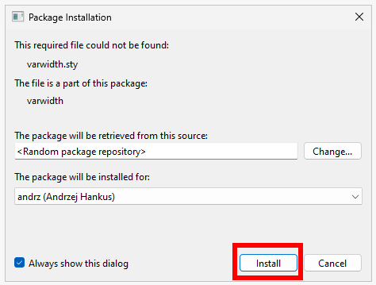
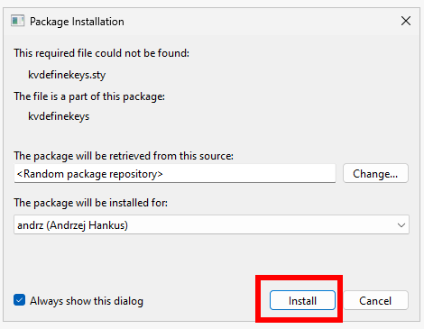
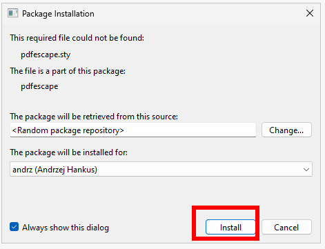
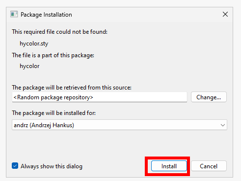
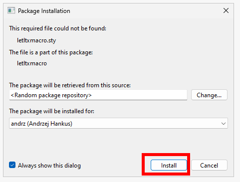
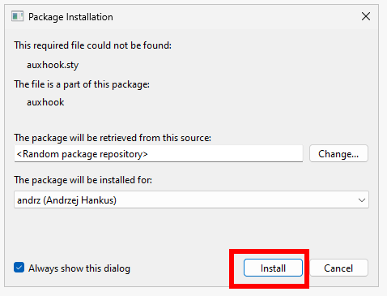


