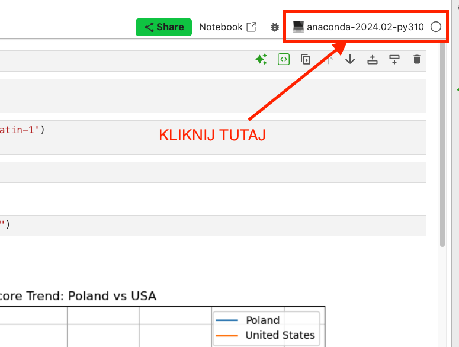
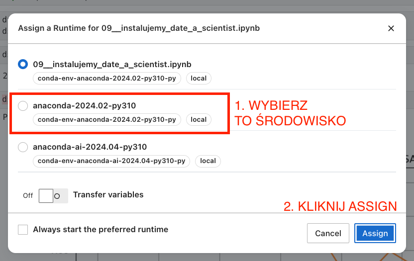

---
tags:
    - Anaconda Cloud
---

# **Anaconda Cloud - problemy**

## Problemy przy instalacji `date-a-scientist`

Pierwsze co do czego musimy się upewnić to czy mamy wybrany odpowiedni kernel:

Po dokonaniu wyboru, uruchom wszystkie komórki z notebooka po kolei.
