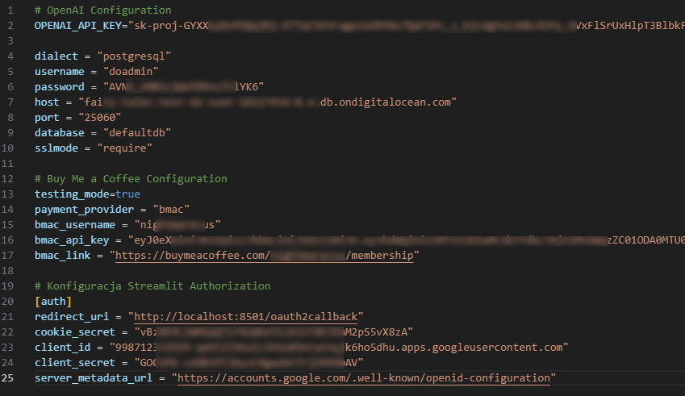
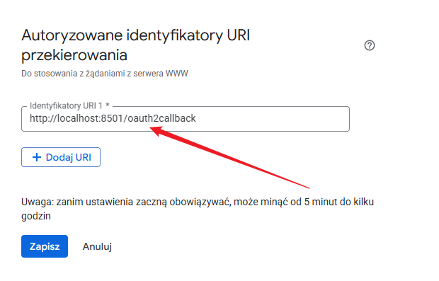

---
tags:
    - Moduł Bonusowy
    - St-paywall
    - Streamlit Authentication
---

# **St-paywall - nowa implementacja**

## Aktualizacja bibliotek i konfiguracji

Jedna z nowszych wersji Streamlit wprowadza wbudowaną autentykację użytkowników, co znacznie upraszcza proces implementacji st-paywall. Jednak, aby to działało, należy wykonać kilka modyfikacji dotychczasowego kodu. Poniżej znajduje się kompletny przewodnik po nowej konfiguracji.

## 1. Wymagane biblioteki

Zaktualizuj swoje zależności do następujących wersji:

```bash
streamlit==1.49.1
st-paywall==1.0.2
authlib==1.6.0
```
Przed instalacją pamiętaj o aktywowaniu środowiska wirtualnego, w którym będziesz uruchamiać aplikację.

## 2. Nowa struktura pliku `secrets.toml`

Zaktualizowany format pliku konfiguracyjnego:

```toml
# OpenAI Configuration
OPENAI_API_KEY="..."

dialect = "postgresql"
username = "doadmin"
password = "..."
host = "..."
port = "25060"
database = "defaultdb"
sslmode = "require"

# Buy Me a Coffee Configuration
testing_mode=true
payment_provider = "bmac"
bmac_username = "..."
bmac_api_key = "..."
bmac_link = "..."

# Konfiguracja Streamlit Authorization
[auth]
redirect_uri = "http://localhost:8501/oauth2callback"
cookie_secret = "..."
client_id = "..."
client_secret = "..."
server_metadata_url = "https://accounts.google.com/.well-known/openid-configuration"
```

!!! warning "Ważne"
    Wartości w pliku `secrets.toml` należy zastąpić własnymi danymi. Należy zachować strukturę pliku podaną powyżej. Docelowo powinno to wyglądać tak:

    

Nowymi wartościami są:

- ```server_metadata_url="https://accounts.google.com/.well-known/openid-configuration"``` - jest to stała wartość, która nie powinna być zmieniana
- ```redirect_uri="http://localhost:8501/oauth2callback"``` - jest to również stała wartość, która nie powinna być zmieniana, jednak zauważ, że treść jest inna niż w poprzednim pliku `secrets.toml`
- ```cookie_secret="..."``` - jest to losowy ciąg znaków, jest wymagany do szyfrowania ciasteczek i musi być unikalny dla każdej aplikacji, należy go wygenerować - w tym celu w notebooku Jupyter wykonaj następującą komendę:
    ```python
    import secrets
    cookie_secret = secrets.token_urlsafe(32)
    print(cookie_secret)
    ```
    Następnie skopiuj wynik i wklej go do pliku `secrets.toml` - będzie to Twój nowy, unikalny cookie secret.


## 3. Konfiguracja Google Cloud

Dodaj nowy redirect URI w Google Cloud Console `http://localhost:8501/oauth2callback`
!!! warning "Ważne"
    Zauważ, że jest to inna treść niż w poprzednim pliku `secrets.toml`



## 4. Nowa implementacja w kodzie

### W miejscu gdzie wcześniej było:
```python
try:
    add_auth(
        required=False,
        login_sidebar=True,
        login_button_text="Zaloguj się przez Google",
    )
except KeyError:
    pass
```
### należy zastąpić na:
```python
with st.sidebar:
    if not st.user.is_logged_in:
        st.button("Zaloguj się", on_click=st.login, use_container_width=True)
    else:
        st.button("Wyloguj się", on_click=st.logout, use_container_width=True)

if st.user.is_logged_in:
    try:
        add_auth(
            required=False,
            use_sidebar=True,
            subscription_button_text="Zostań PREMIUM",
        )
    except KeyError:
        pass
```

## 5. Zmiana sposobu pobierania danych użytkownika

W nowej implementacji pobieramy dane użytkownika w następujący sposób:
```python
email = st.user.email
if st.user.is_logged_in:
    # Kod aplikacji dla zalogowanych użytkowników
    pass
```
Wymusza to na nas najnowsza wersja biblioteki `Streamlit`.

Stary sposób (już nieaktualny) pobierania danych użytkownika:
```python
# NIE UŻYWAJ - przestarzałe
email = st.session_state['email']
```

## 6. Struktura głównej aplikacji

Poniżej przedstawiony jest zarys głównych zmian w strukturze aplikacji. To nie jest kompletna aplikacja, a jedynie przykład pokazujący wprowadzone modyfikacje, gotowy plik znajdziesz pod przykładem: 

```python
import streamlit as st
from st_paywall import add_auth

# Konfiguracja strony
st.set_page_config(page_title="Twoja Aplikacja", layout="wide")

# Obsługa autentykacji w sidebarze
with st.sidebar:
    if not st.user.is_logged_in:
        st.button("Zaloguj się", on_click=st.login, use_container_width=True)
    else:
        st.button("Wyloguj się", on_click=st.logout, use_container_width=True)

# Główna logika aplikacji
if st.user.is_logged_in:
    try:
        add_auth(
            required=False,
            use_sidebar=True,
            subscription_button_text="Zostań PREMIUM",
        )
    except KeyError:
        pass
    
    # Pobierz email użytkownika
    email = st.user.email
    
    # Tutaj umieść kod swojej aplikacji
    st.title("Witaj w aplikacji!")
    st.write(f"Zalogowany jako: {email}")
    
else:
    st.title("Musisz się zalogować")
    st.write("Kliknij 'Zaloguj się' w panelu bocznym, aby kontynuować.")
```

---

**Pobierz gotowy plik:** <a href="../assets/app_v4.py" download>app_v4.py</a>

!!! warning "Ważne"
    Plik `app_v4.py` jest gotowym plikiem, który możesz użyć do uruchomienia aplikacji. Jednak, aby uruchomić aplikację, należy pamiętać, że należy również uzupełnić wartości w pliku `secrets.toml` oraz zaktualizować redirect URI w Google Cloud Console.
