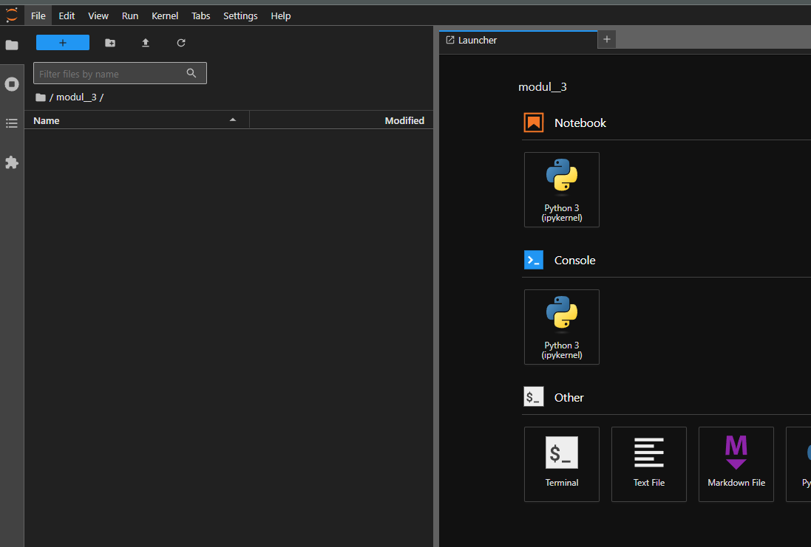
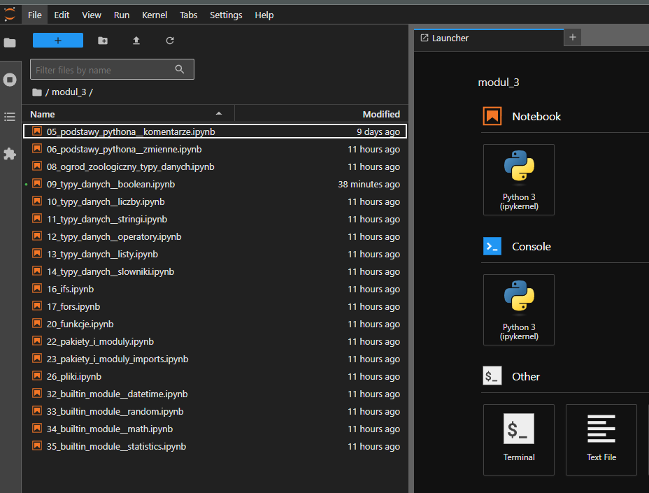
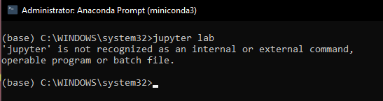
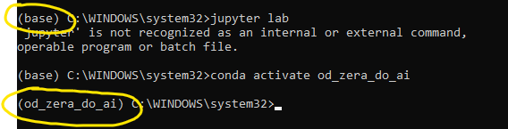
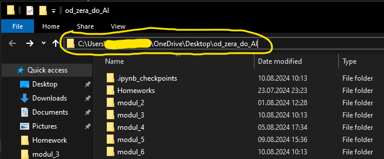
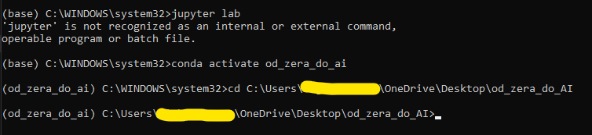
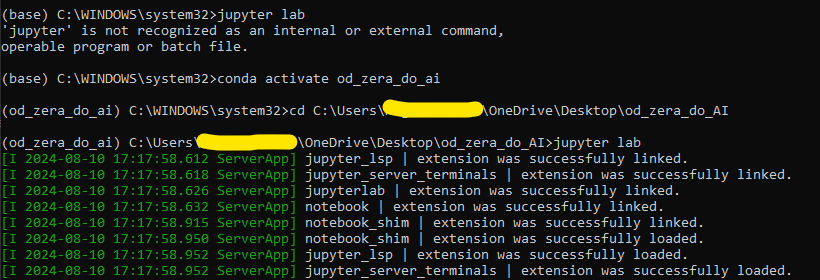

# **Jak zainstalować i skonfigurować conda**

`conda` to narzędzie do zarządzania środowiskami w Pythonie. Dzięki niemu możemy łatwo instalować i zarządzać pakietami w Pythonie.

## **Jak zainstalować conda**

- [Instrukcja instalacji conda pod Macos](assets/conda__installation_for_macos.pdf)
- [Instrukcja instalacji conda pod Windows](assets/conda__installation_for_windows.pdf)

## **Jak skonfigurować conda**

- [Instrukcja konfiguracji conda](assets/conda__configuration.pdf)

## **Zainstalowałem i skonfigurowałem condę, jednak folder `modul_3` jest pusty**

Na początku folder modul_3 jest pusty, ale z każdą kolejną lekcją stopniowo go zapełnisz.
Docelowo na końcu modułu Twój folder będzie wyglądał tak:

## **Kiedy uruchamiam *jupyter lab* przez terminal pojawia się nietypowy błąd**

Jeśli podczas uruchamiania *jupyter lab* w konsoli pojawia się taki błąd, oznacza to, że nie aktywowałeś swojego środowiska Conda. Aby to zrobić:
    
1. Najpierw aktywuj swoje środowisko, wpisując `conda activate od_zera_do_ai` (domyślnie według kursu). Zauważysz wtedy, że środowisko zostało zmienione z domyślnego 'base' na Twoje własne.

    

1. Następnie przejdź do folderu z Twoimi notebookami (domyślnie w kursie jest to folder na pulpicie o nazwie *od_zera_do_ai*) i skopiuj jego ścieżkę.

    

1. Przejdź do tego folderu w konsoli, używając komendy `cd` i wklejając jego ścieżkę

    

1. Na koniec uruchom `jupyter lab`

    