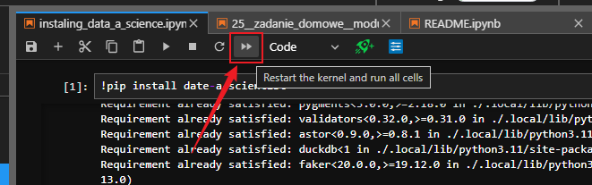

# **Problemy z biblioteką `date-a-scientist`**

`date-a-scientist` to narzędzie, które pozwala zadawać pytania dotyczące danych w formacie Pandas DataFrame bezpośrednio w Jupyter Notebooku, wykorzystując do tego język naturalny. Dzięki niemu możesz analizować i przetwarzać dane w sposób bardziej intuicyjny, formułując zapytania w prostym, zrozumiałym dla Ciebie języku, zamiast pisać skomplikowany kod.

## **Jak zainstalować bibliotekę `date-a-scientist`?**

- Dodaj nową komórkę w jupyter notebook
- wklej i uruchom poniższy kod

```python
!pip install -U date-a-scientist
```

## **Widzę błąd `ERROR: Could not find a version that satisfies the requirement`**

Sprawdź czy nie masz literówki w nazwie pakietu. Może być tak, że nazwa pakietu jest niepoprawna.

* Poprawna nazwa pakietu to `date-a-scientist` (z myślnikiem, a nie podkreślnikiem).
* Częstym błędem jest wpisywanie `data` zamiast `date`.


## **Po instalacji pakietu `date-a-scientist` z Anaconda Cloud nie mogę go zaimportować albo notebook go nie widzi**

Jeśli wszystko wydaje się być w porządku, lecz pojawiają się poniższe błędy:


Spróbuj zrestartować kernel i uruchomić ponownie wszystkie komórki w notebooku Jupyter. Aby to zrobić, kliknij przycisk oznaczony na poniższym obrazku (`Restart the kernel and run all cells`).



Znajdziesz go w górnej części interfejsu, obok przycisków nawigacyjnych. Po kliknięciu tego przycisku kernel zostanie zrestartowany, a wszystkie komórki w notebooku zostaną uruchomione ponownie.

## **Widzę błąd `UnicodeEncodeError` jak wpisuję polskie znaki w date-a-scientist**


Żeby zaadresować ten problem wykonaj następujące kroki (na Windowsie):

1. Otwórz **Panel sterowania**.
1. Przejdź do **System i zabezpieczenia > System > Zaawansowane ustawienia systemu**.
1. Kliknij przycisk **Zmienne środowiskowe**.
1. W sekcji **Zmienne systemowe** kliknij **Nowa**.
1. Dodaj zmienną:
    * Nazwa zmiennej: `PYTHONIOENCODING`
    * Wartość zmiennej: `utf-8`

1. Dodaj kolejną zmienną:
    * Nazwa zmiennej: `PYTHONUTF8`
    * Wartość zmiennej: `1`

1. Zatwierdź zmiany, klikając **OK**.

I wówczas zamknij Jupyter Lab i otwórz ponownie


## **Nie mogę zainstalować pakietu `date-a-scientist`. Widzę ogromny komunikat o błędzie**


Jeśli widzisz błąd, w pierwszej kolejności sprawdzaj jego początek i koniec. Tam najczęściej jest najwięcej informacji. W tym przypadku zerknij na koniec komunikatu i zwróć uwagę czy zawiera informację o braku `Microsoft Visual C++`. Np w komunikacie: `error: Microsoft Visual C++ 14.0 is required. Get it with "Microsoft Visual C++ Build Tools": https://visualstudio.microsoft.com/visual-cpp-build-tools/` Jeśli tak, to należy zainstalować `Microsoft Visual C++ Build Tools` z linku podanego w komunikacie. Ważne jest, aby podczas instalacji zaznaczyć opcję `Programowanie aplikacji klasycznych w C++`.


## **W trakcie instalacji pakietu `date-a-scientist` pojawiają się różne kolorowe komunikaty o ostrzeżeniach i błędach**


Jeśli zobaczysz całą serię ostrzeżeń i błędów podczas instalacji, nie musisz się martwić, o ile na końcu pojawi się komunikat o pomyślnym zainstalowaniu biblioteki. Dla pewności możesz ponownie uruchomić komórkę z instalacją – to powinno usunąć wszelkie ostrzeżenia.


Zaznaczony fragment świadczy o prawidłowym zainstalowaniu biblioteki.