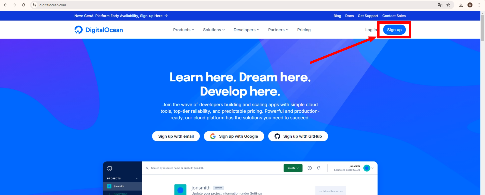

---
tags:
    - Moduł 9
    - Digital Ocean
    - Chmura
---
# Digital Ocean

DigitalOcean to platforma chmurowa, która umożliwia użytkownikom tworzenie i zarządzanie serwerami wirtualnymi (nazywanymi "dropletami"). Jest skierowana głównie do programistów i małych firm, oferując prostą i intuicyjną obsługę. Użytkownicy mogą uruchamiać na niej aplikacje, strony internetowe czy bazy danych, korzystając z elastycznych zasobów chmury. Dzięki temu można skalować infrastrukturę w zależności od potrzeb. DigitalOcean jest ceniona za przystępność, szybkie wdrożenia oraz transparentne modele kosztów.

## Jak założyć konto w Digital Ocean

1. Wejdź na stronę [digitalocean.com](https://www.digitalocean.com/)

    

1. Wybierz `GitHub` jako formę autoryzacji do Digital Ocean. Aby to zrobić kliknij **Sign Up with GitHub**

    

1. Autoryzuj Digital Ocean,aby mogło używać `GitHub` żeby Cię logować. Aby to zrobić kliknij zielony guzik **Authorize digitalocean**

    

1. Wypełnij ankietę. Najlepiej w taki sposób, jak zaprezentowano na poniższym zrzucie ekranu, a następnie kliknij **Submit**

    

1. Mimo, że otrzymujemy od Digital Ocean darmowe 100$, żeby się pobawić ich chmurą, musimy podpiąć kartę. Wypełnij dane karty i kliknij **Save and Sign Up**

    

1. Jeśli po weryfikacji zobaczymy ekran powitalny, to oznacza że wszystko poszło w porządku. W celu przejścia do konsoli Digital Ocean, należy wcisnąć przycisk **Explore our Control Panel**

    

1. Ekran konsoli Digital Ocean

    