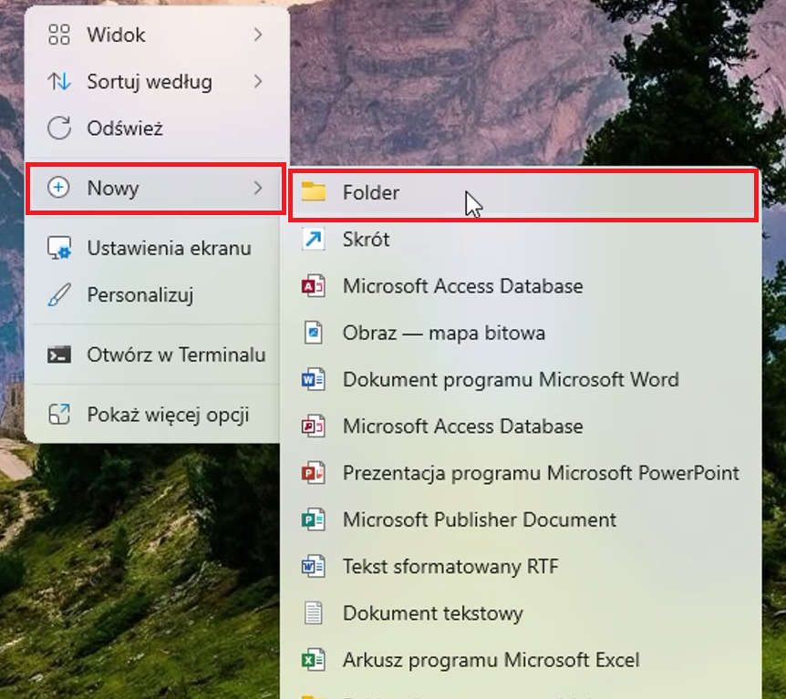
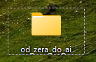
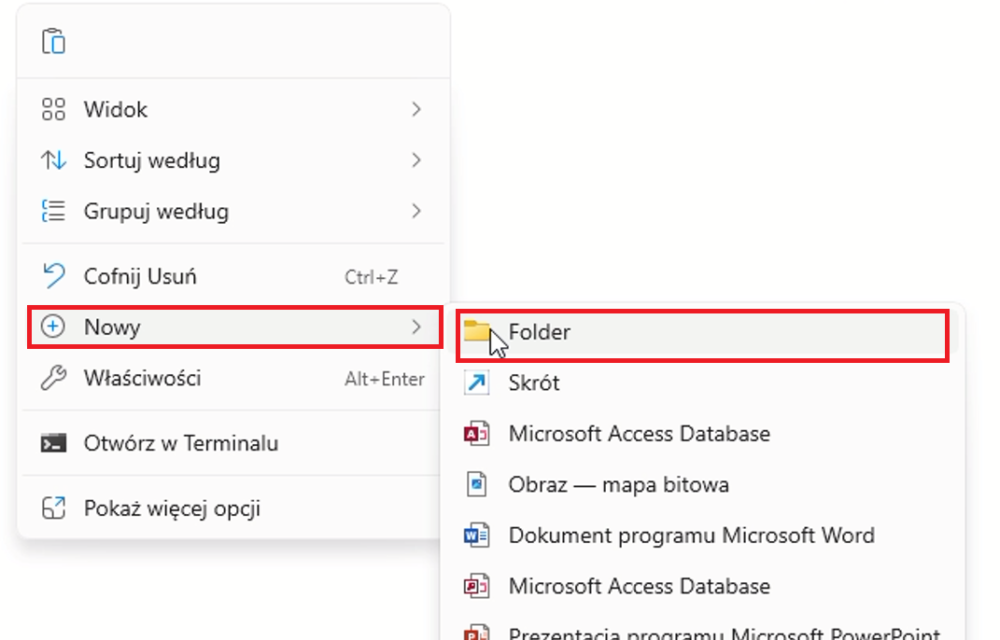
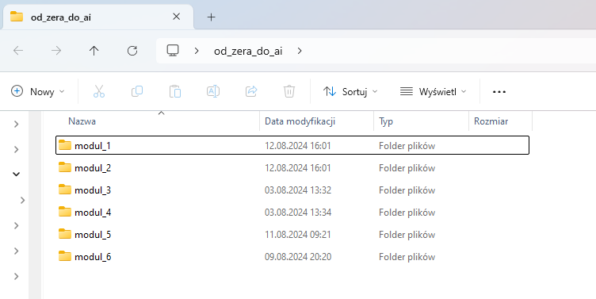
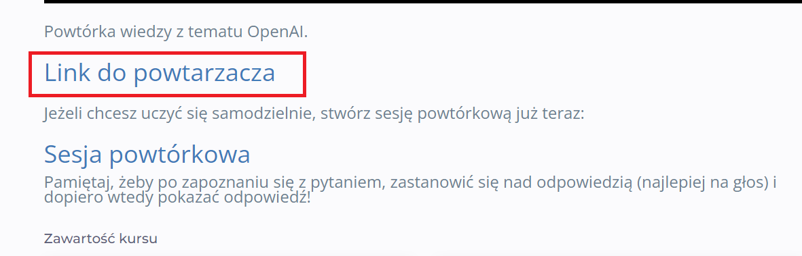
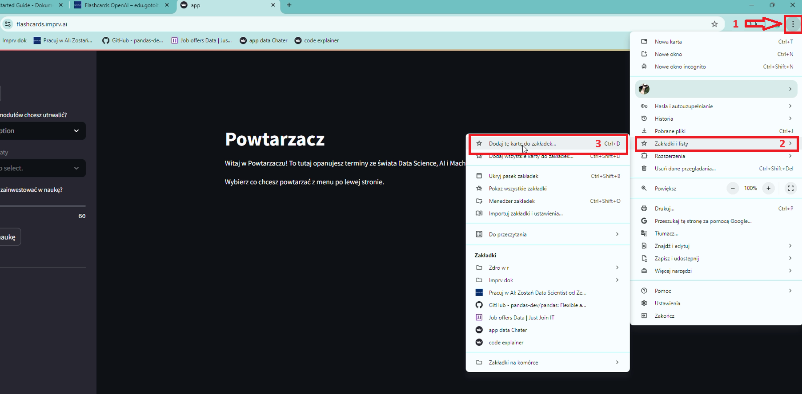
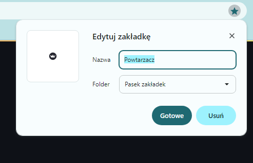
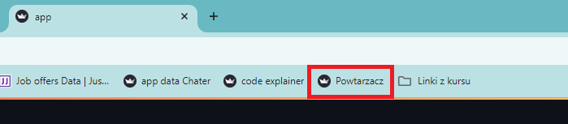
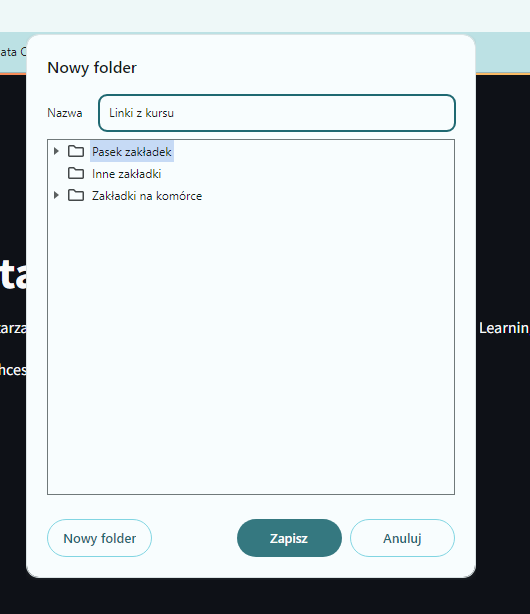
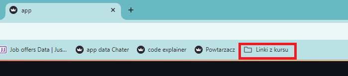

# Jak zacząć pracę z kursem?

Witajcie w przewodniku, który pomoże Wam rozpocząć przygodę z kursem. Znajdziecie tu praktyczne wskazówki i instrukcje.

Kurs dzieli się na 12 modułów, które zawierają w sobie pojedyncze lekcje. W każdej lekcji czeka na Was film z omówieniem tematu i opis tematu. Do lekcji pod filmem i opisem dołączane są niezbędne materiały. 

Mogą one występować w postaci:

- linków (po naciśnięciu odsyłają do strony internetowej)

- plików do pobrania (po naciśnięciu rozpocznie się proces pobierania na Wasz komputer)

## Tip 1: Gdzie zapisywać materiały?

Z czasem trwania kursu, plików i materiałów będzie coraz więcej. Dlatego zadbaj od początku o zbieranie plików w jednym folderze, z podziałem na moduły.

Instrukcja: 

1. Utwórz na pulpicie nowy folder o nazwie: **od_zera_do_ai**

    Mając kursor myszki na pulpicie naciśnij prawy przycisk myszy.
    Najedź myszką na **Nowy** > kliknij na **Folder** 

    

    Nazwij folder

    

1. Wejdź do tego folderu (najedź na niego myszką i kliknij szybko dwa razy lewym przyciskiem myszy). Utwórz w tym folderze, kolejne foldery tak aby przygotować miejsce na zapisywanie materiałów z kursu. To pomoże Ci zachować przejrzystość i chronologię. 

    Mając kursor myszki w folderze, naciśnij prawy przycisk myszy.
    Najedź na **Nowy** > kliknij na **Folder** 

       

    
    Nazwij nowy folder. Stwórz kilka kolejnych folderów. Nazwij je: **modul_1**, **modul_2**, **modul_3**. Kompletuj w każdym z nich materiały z tych właśnie modułów.

    

## Tip 2 Zapisywanie stron do paska zakładek

W poszczególnych lekcjach będą pojawiały się linki do stron internetowych. Do niektórych stron będziemy często wracać w trakcie trwania kursu. Dlatego polecamy, abyś od początku zapisywał/zapisywała sobie te strony w pasku zakładek w przeglądarce, lub w folderze zakładek w przeglądarce. Dzięki temu, będziesz miał/miała je pod ręką. 

1. Zapisywanie strony do zakładek

    Kliknij w link z lekcji aby wyświetlić zawartość
    

    Po wyświetleniu się strony internetowej, do której prowadził link, najedź myszką w prawy górny róg przeglądarki i naciśnij ikonę trzech kropek. 
    
    Następnie **Zakładki i listy** > **Dodaj tę kartę do zakładek**

    

    Nazwij swoją zakładkę i wybierz, w którym miejscu chcesz ją zapisać.

       

    Dzięki temu strona pojawi się w pasku zakładek i bardzo szybko, jednym kliknięciem, będziesz mógł/mogła do niej zajrzeć.

        

1. Tworzenie folderu w pasku zakładek

    Możesz też utworzyć folder w pasku zakładek, aby tam zapisywać linki przydatne w procesie uczenia się.

    Kliknij prawym przyciskiem myszy na puste miejsce na pasku zakładek w przeglądarce. Wybierz opcję **Dodaj folder**

    

    Nazwij folder i wybierz miejsce gdzie chcesz go mieć w przeglądarce.

      

    Zapisuj sobie wszystkie ważne linki z kursu, tak abyś miał/miała je zawsze pod ręką.

         
