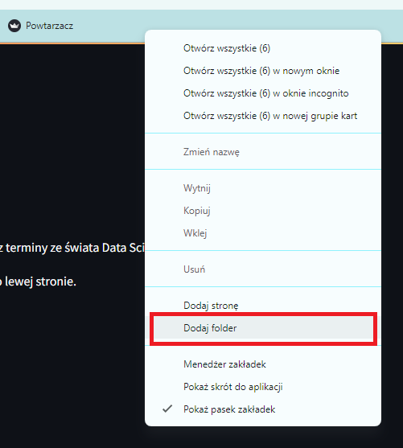

# Jak zacząć pracę z kursem?

Witajcie w przewodniku, który pomoże Wam rozpocząć przygodę z kursem. Znajdziecie tu praktyczne wskazówki i instrukcje.

Kurs dzieli się na 12 modułów, które zawierają w sobie pojedyncze lekcje. W każdej lekcji czeka na Was film z omówieniem tematu i opis tematu. Do lekcji pod filmem i opisem dołączane są niezbędne materiały. 

Mogą one występować w postaci:

- linków (po naciśnięciu odsyłają do strony internetowej)

- plików do pobrania (po naciśnięciu rozpocznie się proces pobierania na Wasz komputer)

!!! info "Gdzie szukać pomocy w razie problemu?"

    W przypadku wystąpienia jakichkolwiek trudności, stworzyliśmy i stale aktualizujemy dla Was sekcję 
    
    **[FAQ - zbiór najczęściej zadawanych pytań](/od-zera-do-ai-faq/#pytania-odpowiedzi)** 
    
    Znajdziecie tam przykłady problemów wraz z wytłumaczeniem i dokładną instrukcją postępowania.
## Tip 1. Jak pracować z lekcjami?

1. Tryb - oglądanie, słuchanie, czytanie.

    Możesz po prostu oglądać filmy i czytać treści zamieszczone pod filmami. Po każdym ważnym temacie czeka na Ciebie film powtórkowy **Flashcards**, który również możesz oglądać i na głos odpowiadać na pytania. Po każdym dziale będą na Ciebie czekały **Zadania domowe**, dzięki którym możesz przećwiczyć zdobytą wiedzę.

2. Tryb - ćwiczenie na równi z filmem.

    W niektórych lekcjach demonstrujemy bezpośrednie zastosowanie pewnych konceptów i narzędzi.

    Przy takich filmach gorąco zachęcamy do aktywnego przejścia przez lekcję razem z nami, krok po kroku.

    Pod filmem i opisem załączone są materiały (pliki, linki), używane w danej lekcji. Pobierz je, otwórz i powtarzaj kroki zaprezentowane przez mentora. 

    Kliknij w link, zacznie się pobieranie pliku:

    

    Następnie ustaw okna tak, aby po jednej stronie widzieć okno przeglądarki z filmem z lekcji, a po drugiej stronie otwarty plik z pobranym materiałem z tej lekcji (np. z Notebookiem). 
    Najedź kursorem na otwarty plik w przeglądarce > naciśnij prawym przyciskiem myszy > wybierz **Przenieś kartę do innego okna** > **Nowe okno**

    

    Następnie naciśnij ikonę kwadratu w prawych górnych rogach okien przeglądarek i ustaw sobie okno z filmem po jednej stronie, a z materiałem po drugiej. 

    

    W ten sposób możesz jednocześnie oglądać film i samodzielnie uruchamiać procesy, testować - bawić się kodem i funkcjami.

    

    Dodatkowo, rozwiązując kilka lekcji z rzędu, możesz łatwo przenosić i otwierać kolejne pobrane pliki:

    Pobierz plik > naciśnij ikonę **Pobrane pliki** > wybierz najnowszy pobrany plik, złap go i przenieś do drzewa plików w notebooku

    
## Tip 2. Kolejność lekcji na platformie

Jak przechodzić lekcje chronologicznie?

Pod każdą lekcją widnieje spis zawartości kursu. Możesz tam zobaczyć, w którym miejscu aktualnie się znajdujesz (zaznaczone na szaro), ile jeszcze przed Tobą, a ile za. Kolejność lekcji wypisana jest w dwóch pionowych kolumnach. Przejdź najpierw całą lewą kolumnę (od góry do dołu), a potem całą prawą kolumnę. 
    
1. Chcąc przejść chronologicznie do kolejnej lekcji, naciśnij na tę, która jest pod spodem.
    
    
    
2. Innym sposobem na przechodzenie do następnej lekcji w odpowiedniej kolejności jest naciśnięcie przycisku **Następna** w prawym rogu nad filmem.
    
    

## Tip 3. Gdzie zapisywać materiały?

Z czasem trwania kursu, plików i materiałów będzie coraz więcej. Dlatego zadbaj od początku o zbieranie plików w jednym folderze, z podziałem na moduły.

Instrukcja: 

1. Utwórz na pulpicie nowy folder o nazwie: **od_zera_do_ai**

    Mając kursor myszki na pulpicie naciśnij prawy przycisk myszy.
    Najedź myszką na **Nowy** > kliknij na **Folder** 

    

    Nazwij folder

    

1. Wejdź do tego folderu (najedź na niego myszką i kliknij szybko dwa razy lewym przyciskiem myszy). Utwórz w tym folderze, kolejne foldery tak aby przygotować miejsce na zapisywanie materiałów z kursu. To pomoże Ci zachować przejrzystość i chronologię. 

    Mając kursor myszki w folderze, naciśnij prawy przycisk myszy.
    Najedź na **Nowy** > kliknij na **Folder** 

       

    
    Nazwij nowy folder. Stwórz kilka kolejnych folderów. Nazwij je: **modul_1**, **modul_2**, **modul_3**. Kompletuj w każdym z nich materiały z tych właśnie modułów.

    

## Tip 4. Zapisywanie stron do paska zakładek

W poszczególnych lekcjach będą pojawiały się linki do stron internetowych. Do niektórych stron będziemy często wracać w trakcie trwania kursu. Dlatego polecamy, abyś od początku zapisywał/zapisywała sobie te strony w pasku zakładek w przeglądarce, lub w folderze zakładek w przeglądarce. Dzięki temu, będziesz miał/miała je pod ręką. 

1. Zapisywanie strony do zakładek

    Kliknij w link z lekcji aby wyświetlić zawartość
    

    Po wyświetleniu się strony internetowej, do której prowadził link, najedź myszką w prawy górny róg przeglądarki i naciśnij ikonę trzech kropek. 
    
    Następnie **Zakładki i listy** > **Dodaj tę kartę do zakładek**

    

    Nazwij swoją zakładkę i wybierz, w którym miejscu chcesz ją zapisać.

       

    Dzięki temu strona pojawi się w pasku zakładek i bardzo szybko, jednym kliknięciem, będziesz mógł/mogła do niej zajrzeć.

        

1. Tworzenie folderu w pasku zakładek

    Możesz też utworzyć folder w pasku zakładek, aby tam zapisywać linki przydatne w procesie uczenia się.

    Kliknij prawym przyciskiem myszy na puste miejsce na pasku zakładek w przeglądarce. Wybierz opcję **Dodaj folder**

    

    Nazwij folder i wybierz miejsce gdzie chcesz go mieć w przeglądarce.

      

    Zapisuj sobie wszystkie ważne linki z kursu, tak abyś miał/miała je zawsze pod ręką.

    

## Tip 5. Jak zrobić screena?

Screen - elektroniczny zapis, zrzut obrazu aktualnie wyświetlanego na ekranie komputera. To tak jakby zrobić zdjęcie tego co widzimy na naszym komputerze/monitorze. Screen można zapisać jako plik, można go do kogoś przesłać, coś na nim zaznaczyć, narysować. 
Robienie screenów będzie przydatne w kursie, aby pokazywać zadania domowe albo formułować pytania, zgłaszać problemy.

1. Jak zrobić screena - narzędzie wycinanie.

    W miejsce wyszukiwania na pasku zadań wpisz **Narzędzie Wycinanie**, kliknij w nie

    

    Uruchamia się **Narzędzie Wycinanie**

     

    Możesz kliknąć w przycisk **Nowy** albo użyć skrótu klawiszowego **Logo Windows + Shift + S**, następnie zaznacz myszką obszar, który chcesz wyciąć. 
    
    To widok pulpitu i zaznaczenie obszaru:

     

    A tak widać, uzyskanego przez zaznaczenie, screena w **Narzędziu Wycinania**

     

    Sprawdź ustawienia Twojego Narzędzia Wycinania, aby wiedzieć gdzie będą zapisywały się Twoje screeny.

     

    Przy takim ustawieniu, screeny będą trafiały do **Obrazy** > **Zrzuty ekranu**   

    
 

    W Narzędziu Wycinanie możesz edytować Twojego screena, rysować po nim, zaznaczać, podkreślać, robić strzałki.

    

    Możesz wybrać kolor zaznaczania i rozmiar lini.
    
    

## Tip 6. Jak i gdzie zgłaszać problem?

Jeśli w trakcie przechodzenia kursu, wystąpi u Ciebie problem i nie znajdziesz rozwiązania w dziale FAQ, napisz do nas na Discordzie.

Link do naszego kanału znajduje się na stronie głównej kursu **Pracuj w AI: Zostań Data Scientist od Zera:**
    
[Link do strony](https://edu.gotoit.pl/index.php/pracuj-w-ai-data-science/)

Aby zgłosić problem na Discordzie, który jest miejscem wymiany doświadczeń i pomocy między kursantami i mentorami, postępuj zgodnie z poniższymi krokami:

1. Wybierz odpowiedni kanał, zgodny z modułem, w którym masz problem np. modul-1-pytania-i-problemy jeśli Twój problem dotyczy lekcji z modułu pierwszego

    Tak wygląda lista kanałów:

    

2. W wiadomości załącz link do lekcji, w której wystąpił Twój problem 
3. Opisz jak najwięcej informacji o Twoim problemie
4. Zamieść jeden lub więcej screenów, żeby pokazać szczegóły Twojego problemu. Jeśli wyskakuje Ci błąd w kodzie, zadbaj o to by pokazać początek - nazwę błędu i koniec błędu. Na screenie możesz zaznaczyć strzałkami lub podkreślić dokładnie miejsca, które stwarzają problem. Pokaż też używane pliki i ich nazwy.
    
    **Początek błędu:**

    

    **Koniec błędu:**

    

    **Widok na okno Discorda:**

    

    **Przykład zgłoszenia problemu z modułu 5:**

    

    Tak wygląda wiadomość przed wysłaniem. Możesz jeszcze zmienić załączone pliki, usunąć, dodać. **Naciśnij Enter aby wysłać.**

    

    **Tak wygląda wysłana wiadomość:**

    

    **Czekaj na odpowiedź.**

## Tip 7. Jak spakować pliki do ZIP-a?

W przypadku, gdy będziesz miał/miała wiele plików w folderze z zadaniem domowym, aby je wysłać, można skompresować ten cały folder do formatu ZIP. Spakowanie plików pozwala na wysłanie kilku plików jako jednego pliku, a kompresja pozwala, zmniejszyć rozmiar przesyłanych danych, co ułatwia ich wysyłanie. Sam proces jest szybki i prosty.

Wystarczy, że: **Klikniesz prawym przyciskiem myszy na folder,** który chcesz kompresować **>** najedź na: **Kompresuj do >** wybierz **Plik ZIP**

Pod folderem, który wybrałeś/wybrałaś, pojawi się skompresowany folder w formacie ZIP. Jeśli jest taka potrzeba możesz jeszcze zmienić jego nazwę.

**I gotowe!** Tak przygotowany folder np. z zadaniem domowym, możesz wysyłać na Discordzie.

 

       

