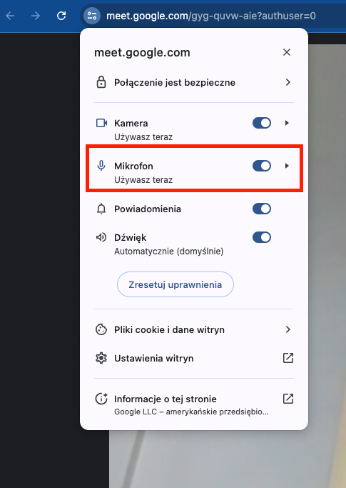
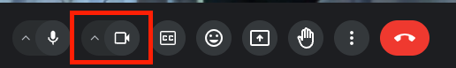
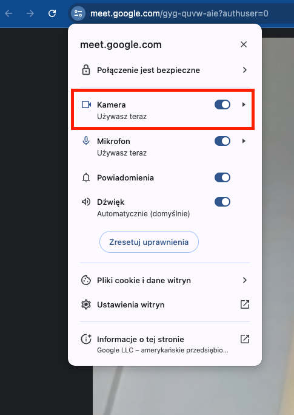
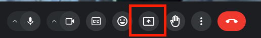
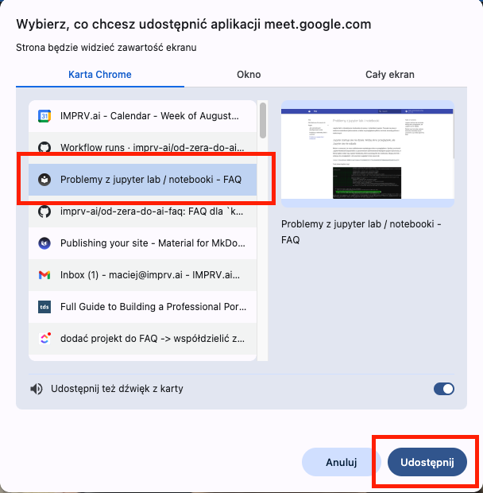

# Google Meet

## Inni uczestnicy mnie nie słyszą, co robić?

Użyj przycisku mikrofonu w Google Meet:

Jeżeli powyższy przycisk jest wyszarzony sprawdź czy masz mikrofon podłączony do komputera i czy jest on włączony.
Oraz kliknij w lewym górnym rogu na ikonkę opcji:

## Inni uczestnicy mnie nie widzą, co robić?

Użyj przycisku kamery w Google Meet:

Jeżeli powyższy przycisk jest wyszarzony sprawdź czy masz kamerę podłączoną do komputera i czy jest ona włączona:

## Jak współdzielić ekran w Google Meet?

Aby współdzielić ekran w Google Meet kliknij przycisk "Prezentuj" u dołu ekranu:

Następnie wybierz co chcesz udostępnić:

