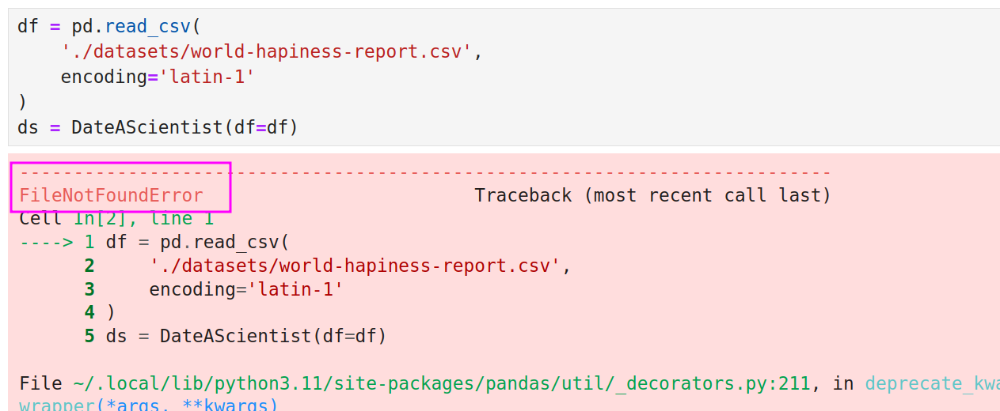

# **Problemy z jupyter lab / notebooki**

**Jupyter lab** to interaktywne środowisko do pracy z notatnikami jupyter. Pozwala na pracę z wieloma notatnikami jednocześnie, a także na przeglądanie plików, terminal, konsolę pythona i wiele innych.

## **Jupyter startuje, ale nie działa. Widzę okno przeglądarki, ale Jupyter się nie odpala**

Może to oznaczać, że masz zablokowane wyskakujące okna w przeglądarce. Spróbuj uruchomić Jupyter Notebook bezpośrednio z uprawnieniami administratora Następnie pojawi się konsola, w której będzie widać logi Jupyter Notebooka, które zawierają link do notebooka. Skopiuj ten link i wklej go do przeglądarki. Link powinien wyglądać mniej więcej tak:

`http://localhost:8888/tree?token=f7e5908823221f7bc83e0382337300e6bbe552e2013cc27f`

Twój token będzie inny!

## **Śledzę kurs lub robię zadanie domowe i komórka się nie uruchamia, a ja widzę ogromny błąd**

Jeżeli widzisz błąd:

Zwróć uwagę na początek komunikatu o błędzie .
Jeśli jest tam informacja o braku pliku (np. `FileNotFoundError` jak na obrazku) to najprawdopodobniej masz błąd w ścieżce lub plik nie został pobrany we wskazane miejsce.

Sprawdź czy ścieżki są poprawne i czy plik istnieje.

Pliki z danymi znajdziesz w sekcji `Pliki do pobrania` pod filmami na platformie kursu.

## **Kiedy uruchamiam *jupyter lab* przez terminal pojawia się nietypowy błąd**

Jeśli podczas uruchamiania *jupyter lab* w konsoli pojawia się taki błąd, oznacza to, że nie aktywowałeś swojego środowiska Conda. Aby to zrobić:
    
1. Najpierw aktywuj swoje środowisko, wpisując `conda activate od_zera_do_ai` (domyślnie według kursu). Zauważysz wtedy, że środowisko zostało zmienione z domyślnego 'base' na Twoje własne.

    

1. Następnie przejdź do folderu z Twoimi notebookami (domyślnie w kursie jest to folder na pulpicie o nazwie *od_zera_do_ai*) i skopiuj jego ścieżkę.

    

1. Przejdź do tego folderu w konsoli, używając komendy `cd` i wklejając jego ścieżkę

    

1. Na koniec uruchom `jupyter lab`

    