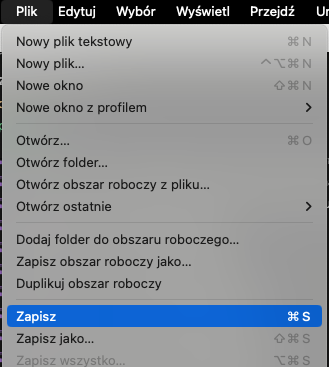

# Jak zainstalować Visual Studio Code?

* Uruchum link: [https://code.visualstudio.com/download](https://code.visualstudio.com/download)
* wybierz Windows jeśli masz Windowsa, Mac jeśli masz Maca, Linux jeśli masz Linuksa
* po kliknięciu rozpocznie się pobieranie instalatora
* uruchom instalator
* postępuj zgodnie z instrukcjami na ekranie
* pamiętaj aby utworzyć skrót na pulpicie

# Jak zapisywać zmiany w pliku?

Aby zapisać zmiany w pliku w Visual Studio Code:

* w górnym pasku menu kliknij `Plik` > `Zapisz`

* lub wciśnij `ctrl + s` (jednocześnie kliknij `ctrl` i `s`) w Windows
* lub `cmd + s` w Macos (jednocześnie kliknij `cmd` i `s`)

# Jak chować Eksplorator plików i folderów?

Eksplorator plików i folderów to lewa kolumna w Visual Studio Code, w której możemy przeglądać pliki i foldery w naszym projekcie.

Aby schować Eksplorator plików i folderów w Visual Studio Code:

* kliknij ikonę Eksploratora w lewym górnym rogu

* lub `ctrl + b` (jednocześnie kliknij `ctrl` i `b`) w Windows
* lub `cmd + b` w Macos (jednocześnie kliknij `cmd` i `b`)

# Jak otwierać folder w Visual Studio Code?

Aby otworzyć folder w Visual Studio Code:

* w górnym pasku menu kliknij `Plik` > `Otwórz folder`
* wybierz folder, który chcesz otworzyć (ale w niego nie wchodź)
* kliknij `Otwórz`

# Jak otwierać terminal w Visual Studio Code?

Aby otworzyć terminal w Visual Studio Code:

* w górnym pasku menu kliknij `Terminal` > `Nowy Terminal`

# Jak dodawać pliki w Visual Studio Code?

Aby dodać plik w Visual Studio Code:

* kliknij ikonę nowego pliku w Eksploratorze plików i folderów

* wpisz nazwę pliku
* naciśnij `Enter`

Alternatywnie:

* kliknij prawym przyciskiem myszy na folderze w Eksploratorze
* wybierz `Nowy plik`
* wpisz nazwę pliku
* naciśnij `Enter`

# Jak dodawać foldery w Visual Studio Code?

Aby dodać folder w Visual Studio Code:

* kliknij ikonę nowego folderu w Eksploratorze plików i folderów

* wpisz nazwę folderu
* naciśnij `Enter`

Alternatywnie:

* kliknij prawym przyciskiem myszy na folderze w Eksploratorze
* wybierz `Nowy folder`
* wpisz nazwę folderu
* naciśnij `Enter`

# Jak korzystać z palety poleceń w Visual Studio Code?

Paleta poleceń to narzędzie, które pozwala na szybkie wyszukiwanie i uruchamianie poleceń w Visual Studio Code.

Aby otworzyć paletę poleceń w Visual Studio Code:

* w górnym pasku menu kliknij `Wyświetl` > `Paleta Poleceń`
* lub wciśnij `ctrl + shift + p` (jednocześnie kliknij `ctrl`, `shift` i `p`) w Windows
* lub `cmd + shift + p` w Macos (jednocześnie kliknij `cmd`, `shift` i `p`)
