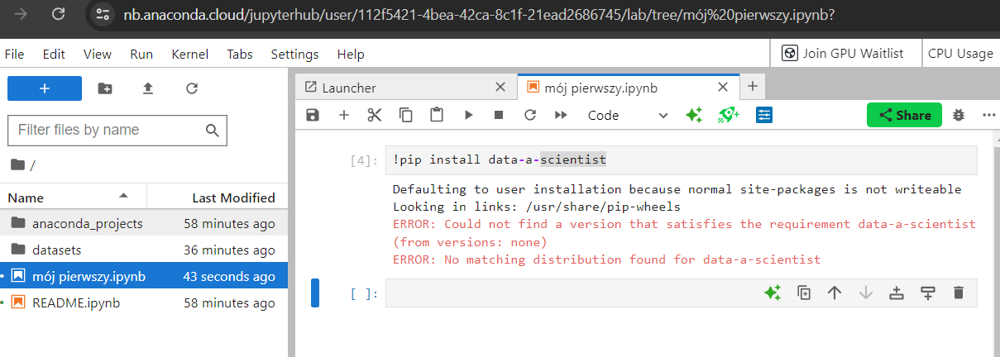
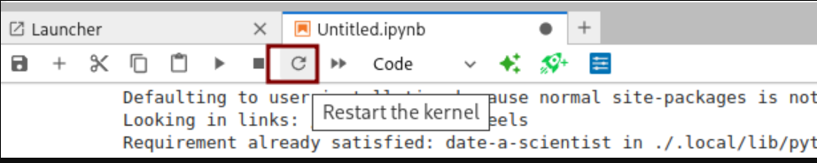
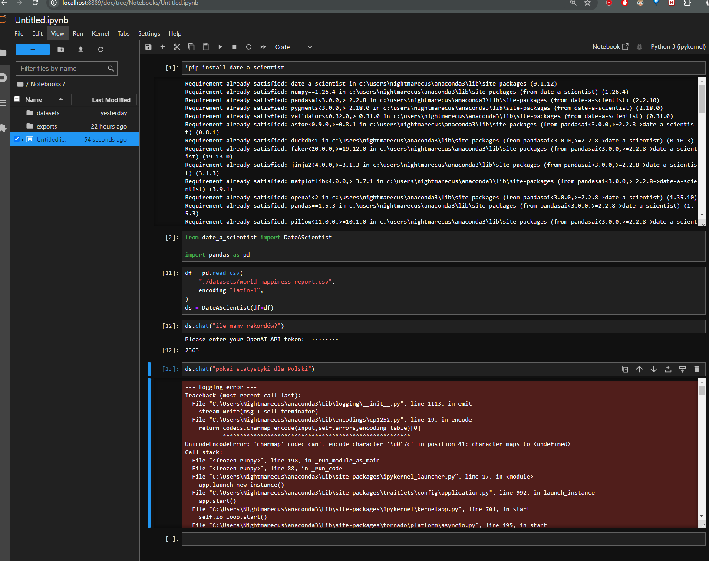
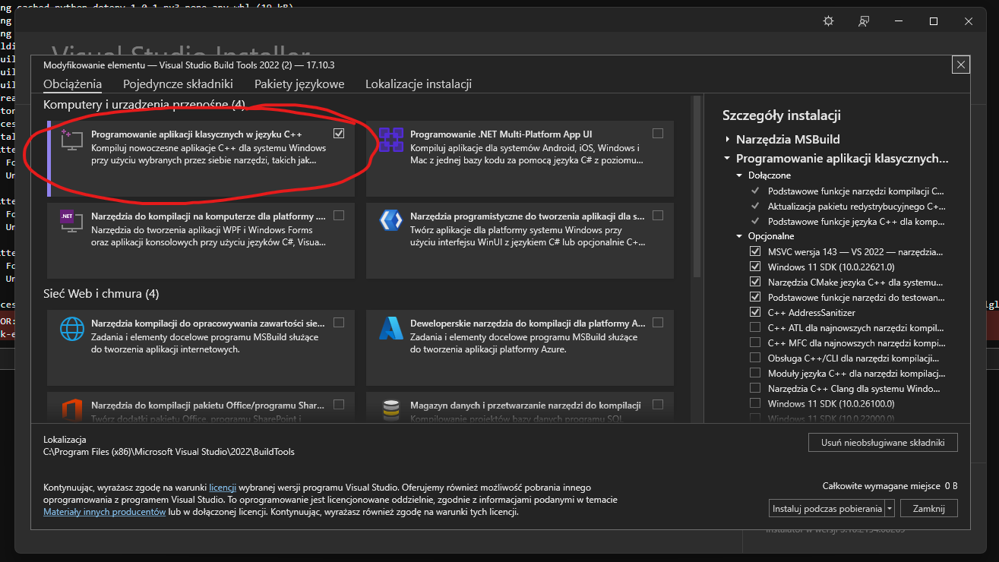

# Problemy z biblioteką `date-a-scientist`

`date-a-scientist` umożliwiające zadawanie pytań o pandas DataFrame'y w jupyter notebooku używając języka naturalnego.

## Jak zainstalować bibliotekę `date-a-scientist`?

- Dodaj nową komórkę w jupyter notebook
- wklej i uruchom poniższy kod

```python
!pip install -U date-a-scientist
```

## Widzę błąd `ERROR: Could not find a version that satisfies the requirement`

Sprawdź czy nie masz literówki w nazwie pakietu. Może być tak, że nazwa pakietu jest niepoprawna.

* Poprawna nazwa pakietu to `date-a-scientist` (z myślnikiem, a nie podkreślnikiem).
* Częstym błędem jest wpisywanie `data` zamiast `date`.



## Po instalacji pakietu `date-a-scientist` z Anaconda Cloud nie mogę go zaimportować albo notebook go nie widzi

Jeżeli widzisz błąd:


Aby zainstalowany pakiet dało się zaimportować, należy uruchomić ponownie kernel.
W tym celu kliknij ikonkę `Restart kernel` (ikonka przypomina guzik replay) na górnej belce nad komórkami notebooka.



## Widzę błąd `UnicodeEncodeError` jak wpisuję polskie znaki w date-a-scientist



Żeby zaadresować ten problem wykonaj następujące kroki (na Windowsie):

1. Otwórz **Panel sterowania**.
1. Przejdź do **System i zabezpieczenia > System > Zaawansowane ustawienia systemu**.
1. Kliknij przycisk **Zmienne środowiskowe**.
1. W sekcji **Zmienne systemowe** kliknij **Nowa**.
1. Dodaj zmienną:
    * Nazwa zmiennej: `PYTHONIOENCODING`
    * Wartość zmiennej: `utf-8`

1. Dodaj kolejną zmienną:
    * Nazwa zmiennej: `PYTHONUTF8`
    * Wartość zmiennej: `1`

1. Zatwierdź zmiany, klikając **OK**.

I wówczas zamknij Jupyter Lab i otwórz ponownie


## Nie mogę zainstalować pakietu `date-a-scientist`. Widzę ogromny komunikat o błędzie


Jeśli widzisz błąd, w pierwszej kolejności sprawdzaj jego początek i koniec. Tam najczęściej jest najwięcej informacji. W tym przypadku zerknij na koniec komunikatu i zwróć uwagę czy zawiera informację o braku `Microsoft Visual C++`. Np w komunikacie: `error: Microsoft Visual C++ 14.0 is required. Get it with "Microsoft Visual C++ Build Tools": https://visualstudio.microsoft.com/visual-cpp-build-tools/` Jeśli tak, to należy zainstalować `Microsoft Visual C++ Build Tools` z linku podanego w komunikacie. Ważne jest, aby podczas instalacji zaznaczyć opcję `Programowanie aplikacji klasycznych w C++`.


